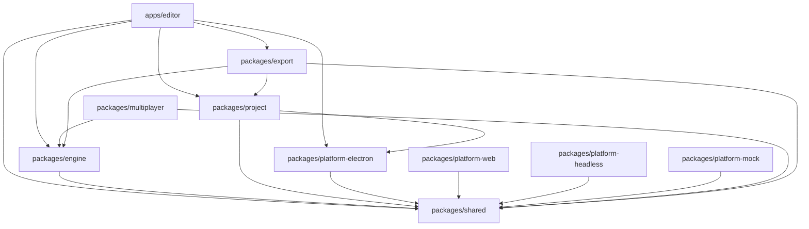

# Architecture Reference

> Full directory structures for the **Eternity codebase** (what developers work in) and the **game project format** (what users create).

---

## 1. Codebase Structure (Monorepo)

Managed by **pnpm workspaces** + **Turborepo**.

```
eternity/
├── .github/
│   └── workflows/
│       ├── ci.yml                  # Lint, typecheck, test on PR
│       └── release.yml             # Build + publish on tag
├── apps/
│   └── editor/                     # Electron app (the editor itself)
│       ├── src/
│       │   ├── main/               # Electron main process
│       │   │   ├── index.ts        # App entry, window creation
│       │   │   ├── ipc.ts          # IPC handlers (file ops, dialogs)
│       │   │   └── menu.ts         # Native menu bar
│       │   ├── preload/
│       │   │   └── index.ts        # contextBridge API exposure
│       │   └── renderer/           # React UI (renderer process)
│       │       ├── App.tsx          # Root component
│       │       ├── catalog.ts      # json-render catalog (defineCatalog)
│       │       ├── registry.ts     # json-render registry (defineRegistry)
│       │       ├── panels/         # Editor panel React components
│       │       │   ├── MapEditor/
│       │       │   ├── DatabaseEditor/
│       │       │   ├── EventEditor/
│       │       │   ├── TilePalette/
│       │       │   ├── MapTree/
│       │       │   ├── PropertyEditor/
│       │       │   ├── AnimationEditor/
│       │       │   ├── CharacterGenerator/
│       │       │   ├── LocalizationEditor/
│       │       │   └── DebugPanel/
│       │       ├── viewport/       # PixiJS canvas integration
│       │       │   ├── MapViewport.tsx
│       │       │   ├── BattleViewport.tsx
│       │       │   └── PreviewViewport.tsx
│       │       ├── dialogs/        # Modal dialogs
│       │       │   ├── ExportDialog.tsx
│       │       │   ├── MapProperties.tsx
│       │       │   └── ProjectSettings.tsx
│       │       └── styles/
│       │           └── index.css
│       ├── electron-builder.yml
│       ├── vite.config.ts
│       ├── tsconfig.json
│       └── package.json
├── packages/
│   ├── engine/                     # Game engine (included in ALL exports)
│   │   ├── src/
│   │   │   ├── index.ts            # Public API barrel
│   │   │   ├── ecs/                # Entity Component System (Miniplex)
│   │   │   │   ├── world.ts        # World instance + entity type
│   │   │   │   ├── components/     # Built-in component definitions
│   │   │   │   └── systems/        # Built-in systems
│   │   │   ├── scene/              # Scene Manager
│   │   │   │   ├── SceneManager.ts
│   │   │   │   ├── Scene.ts
│   │   │   │   ├── transitions/
│   │   │   │   └── scenes/         # Built-in scene types (map, battle, title, menu)
│   │   │   ├── tilemap/            # Tilemap Renderer
│   │   │   │   ├── TilemapRenderer.ts
│   │   │   │   ├── Autotile.ts
│   │   │   │   └── Camera.ts
│   │   │   ├── input/              # Input Manager
│   │   │   │   ├── InputManager.ts
│   │   │   │   └── defaultBindings.ts
│   │   │   ├── assets/             # Asset Manager
│   │   │   │   ├── AssetManager.ts
│   │   │   │   └── loaders/
│   │   │   ├── audio/              # Audio Manager
│   │   │   │   └── AudioManager.ts
│   │   │   ├── events/             # Event System
│   │   │   │   ├── EventRunner.ts
│   │   │   │   ├── commands/       # Built-in event commands
│   │   │   │   └── EventCommand.ts
│   │   │   ├── battle/             # Battle Engine
│   │   │   │   ├── BattleManager.ts
│   │   │   │   ├── DamageFormula.ts
│   │   │   │   └── EnemyAI.ts
│   │   │   ├── scripting/          # Scripting sandbox
│   │   │   │   ├── ScriptRunner.ts
│   │   │   │   ├── sandbox-worker.ts  # Web Worker entry
│   │   │   │   └── api.ts          # Eternity.* API definition
│   │   │   └── animation/
│   │   │       └── SpriteAnimation.ts
│   │   ├── tsconfig.json
│   │   └── package.json
│   ├── shared/                     # Types, schemas, utilities (included EVERYWHERE)
│   │   ├── src/
│   │   │   ├── index.ts
│   │   │   ├── schemas/            # Schema Registry + all built-in Zod schemas
│   │   │   │   ├── registry.ts     # SchemaRegistry class
│   │   │   │   ├── actor.ts
│   │   │   │   ├── class.ts
│   │   │   │   ├── item.ts
│   │   │   │   ├── skill.ts
│   │   │   │   ├── weapon.ts
│   │   │   │   ├── armor.ts
│   │   │   │   ├── enemy.ts
│   │   │   │   ├── state.ts
│   │   │   │   ├── troop.ts
│   │   │   │   ├── tileset.ts
│   │   │   │   ├── map.ts
│   │   │   │   ├── event.ts
│   │   │   │   ├── common-event.ts
│   │   │   │   ├── animation.ts
│   │   │   │   └── system.ts       # System/project-level config schema
│   │   │   ├── types/              # Shared TypeScript types
│   │   │   │   ├── entity.ts
│   │   │   │   ├── components.ts
│   │   │   │   ├── events.ts
│   │   │   │   └── platform.ts
│   │   │   ├── commands/           # Command pattern base
│   │   │   │   ├── Command.ts
│   │   │   │   └── CommandHistory.ts
│   │   │   └── utils/
│   │   │       ├── slug.ts         # Filename slug generation
│   │   │       └── deepEqual.ts
│   │   ├── tsconfig.json
│   │   └── package.json
│   ├── project/                    # Project Manager (file I/O, entity CRUD)
│   │   ├── src/
│   │   │   ├── ProjectManager.ts
│   │   │   ├── EntityStore.ts
│   │   │   ├── FileWatcher.ts
│   │   │   └── LockFile.ts
│   │   ├── tsconfig.json
│   │   └── package.json
│   ├── platform-electron/          # PAL: Electron implementation
│   │   ├── src/
│   │   │   └── ElectronPlatform.ts
│   │   ├── tsconfig.json
│   │   └── package.json
│   ├── platform-web/               # PAL: Web browser implementation
│   │   ├── src/
│   │   │   └── WebPlatform.ts
│   │   ├── tsconfig.json
│   │   └── package.json
│   ├── platform-headless/          # PAL: Headless server implementation
│   │   ├── src/
│   │   │   └── HeadlessPlatform.ts
│   │   ├── tsconfig.json
│   │   └── package.json
│   ├── platform-mock/              # PAL: Test/mock implementation
│   │   ├── src/
│   │   │   └── MockPlatform.ts
│   │   ├── tsconfig.json
│   │   └── package.json
│   ├── multiplayer/                # Network layer + server
│   │   ├── src/
│   │   │   ├── client/
│   │   │   │   ├── NetworkClient.ts
│   │   │   │   ├── Prediction.ts
│   │   │   │   └── Interpolation.ts
│   │   │   ├── server/
│   │   │   │   ├── RelayServer.ts
│   │   │   │   ├── SessionManager.ts
│   │   │   │   └── ViewFilter.ts
│   │   │   └── protocol/
│   │   │       ├── messages.ts
│   │   │       └── codec.ts        # MessagePack encoding
│   │   ├── tsconfig.json
│   │   └── package.json
│   └── export/                     # Export pipeline + targets
│       ├── src/
│       │   ├── ExportPipeline.ts
│       │   ├── AssetOptimizer.ts
│       │   ├── targets/
│       │   │   ├── ElectronTarget.ts
│       │   │   ├── WebTarget.ts
│       │   │   └── ServerTarget.ts
│       │   └── encryption/
│       │       └── AssetEncryption.ts
│       ├── tsconfig.json
│       └── package.json
├── pnpm-workspace.yaml             # Workspace root config
├── turbo.json                      # Turborepo task definitions
├── tsconfig.base.json              # Shared TypeScript config
├── package.json                    # Root package.json (scripts, devDeps)
├── .gitignore
├── LICENSE                         # Open source license
├── README.md
└── docs/                           # This documentation
    ├── prompt.md
    ├── order.md
    ├── architecture.md             # (this file)
    ├── schemas.md
    ├── glossary.md
    ├── plugin-guide.md
    ├── adr/
    │   └── *.md
    └── prd/
        ├── 00-overview.md
        ├── 01-foundation.md
        ├── 02-core-engine.md
        ├── 03-core-editor.md
        ├── 04-game-logic.md
        ├── 05-multiplayer.md
        ├── 06-export.md
        └── 07-polish.md
```

### Package Dependency Graph



### Key Rules

1. **`packages/engine`** never imports from `apps/editor` — the engine is a standalone library
2. **`packages/shared`** has zero dependencies on other workspace packages — it's the leaf node
3. **Platform packages** only depend on `packages/shared` for type definitions
4. **`apps/editor`** is the only package that imports from `packages/platform-electron`
5. No circular dependencies between packages

---

## 2. Game Project Structure (What Users Create)

When a user creates a new project in Eternity, this is the directory layout:

```
my-rpg-game/
├── project.toml                    # Project metadata (name, version, author)
├── config.toml                     # Editor preferences (grid size, last open map)
├── data/
│   ├── system.json                 # System config (start map, starting party, title BGM)
│   ├── actors/
│   │   ├── _index.json             # Entity list + display order
│   │   ├── hero.json
│   │   ├── merchant-nora.json
│   │   └── knight-aldric.json
│   ├── classes/
│   │   ├── _index.json
│   │   ├── warrior.json
│   │   ├── mage.json
│   │   └── thief.json
│   ├── items/
│   │   ├── _index.json
│   │   ├── potion.json
│   │   ├── ether.json
│   │   └── antidote.json
│   ├── skills/
│   │   ├── _index.json
│   │   ├── fire.json
│   │   ├── heal.json
│   │   └── power-strike.json
│   ├── weapons/
│   │   ├── _index.json
│   │   ├── iron-sword.json
│   │   └── oak-staff.json
│   ├── armor/
│   │   ├── _index.json
│   │   ├── leather-armor.json
│   │   └── iron-shield.json
│   ├── enemies/
│   │   ├── _index.json
│   │   ├── slime.json
│   │   └── goblin.json
│   ├── troops/
│   │   ├── _index.json
│   │   ├── slime-x2.json
│   │   └── goblin-pack.json
│   ├── states/
│   │   ├── _index.json
│   │   ├── poison.json
│   │   └── stun.json
│   ├── tilesets/
│   │   ├── _index.json
│   │   ├── overworld.json
│   │   └── dungeon.json
│   ├── animations/
│   │   ├── _index.json
│   │   └── slash.json
│   ├── common-events/
│   │   ├── _index.json
│   │   └── inn-rest.json
│   ├── maps/
│   │   ├── _index.json             # Map tree hierarchy
│   │   ├── hometown/
│   │   │   ├── _map.json           # Tile data, layers, properties
│   │   │   └── events/
│   │   │       ├── old-man-npc.json
│   │   │       ├── treasure-chest.json
│   │   │       └── door-to-inn.json
│   │   ├── hometown-inn/
│   │   │   ├── _map.json
│   │   │   └── events/
│   │   │       └── innkeeper.json
│   │   └── forest-path/
│   │       ├── _map.json
│   │       └── events/
│   │           └── blocking-guard.json
│   └── locales/
│       ├── en/
│       │   └── strings.json        # Base language (auto-generated)
│       └── ja/
│           └── strings.json        # Translation
├── assets/
│   ├── characters/                 # Character sprite sheets
│   │   ├── hero-walk.png
│   │   ├── hero-walk.sprite.json
│   │   ├── elder.png
│   │   └── elder.sprite.json
│   ├── faces/                      # Portrait/face graphics
│   │   ├── hero.png
│   │   └── elder.png
│   ├── tilesets/                   # Tileset images
│   │   ├── overworld-a2.png
│   │   ├── overworld-b.png
│   │   └── dungeon-a2.png
│   ├── parallaxes/                 # Parallax background images
│   │   └── sky.png
│   ├── animations/                 # Battle animation sprite sheets
│   │   └── slash.png
│   ├── audio/
│   │   ├── bgm/                    # Background music
│   │   │   ├── town.ogg
│   │   │   ├── battle.ogg
│   │   │   └── title.ogg
│   │   ├── bgs/                    # Background sounds
│   │   │   ├── rain.ogg
│   │   │   └── wind.ogg
│   │   ├── me/                     # Musical effects
│   │   │   ├── victory.ogg
│   │   │   └── level-up.ogg
│   │   └── se/                     # Sound effects
│   │       ├── cursor.ogg
│   │       ├── confirm.ogg
│   │       ├── cancel.ogg
│   │       └── slash.ogg
│   └── movies/                     # Video cutscenes
│       └── intro.webm
├── scripts/                        # User-authored TypeScript scripts
│   ├── custom-damage.ts
│   └── procedural-dungeon.ts
├── plugins/                        # Installed plugins
│   └── crafting-system/
│       ├── eternity-plugin.json
│       ├── editor/
│       ├── runtime/
│       └── schemas/
├── .eternity/                      # Editor-only state (gitignored)
│   ├── playtest/                   # Playtest save data
│   ├── cache/                      # Asset thumbnails, search index
│   ├── editor-state.json           # Window layout, open tabs, cursor positions
│   └── lock.json                   # Project lock file
├── .gitignore                      # Ignores .eternity/, node_modules/
└── exports/                        # Export output (gitignored)
    ├── my-rpg-game-win32-x64/
    └── my-rpg-game-web/
```

### Key Conventions

| Convention | Rule |
|---|---|
| **One entity per file** | `hero.json`, `potion.json` — never multiple entities in one file |
| **Slug filenames** | `merchant-nora.json`, not `Merchant Nora.json` — lowercase, hyphenated |
| **`_index.json`** | Per-directory index listing entity IDs and display order |
| **`_map.json`** | Map tile data lives in a named directory alongside its events/ |
| **`.sprite.json`** | Animation metadata paired with a `.png` of the same name |
| **TOML for config** | `project.toml`, `config.toml` — human-edited files |
| **JSON for entities** | All game data — programmatically generated by the editor |
| **`.eternity/`** | Editor state, never committed to Git |
