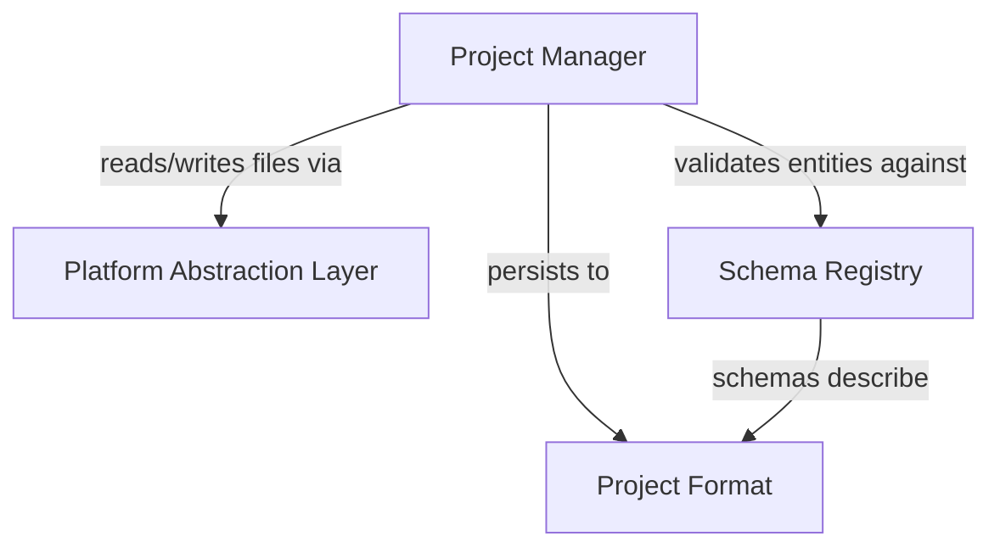

# Phase 1: Foundation

> **Status**: Draft
> **Last updated**: 2026-04-16
> **Parent**: [00-overview.md](./00-overview.md)
> **Prerequisite**: None — this is the first phase. Nothing else should be built until these four modules are solid.

---

## Module 1: Version Control Friendly Project Format

### 1.1 Problem

RPG Maker MZ stores database entities as monolithic JSON arrays (`Actors.json`, `Items.json`, etc.). A single character edit touches the same file as every other character, making Git merges painful. Eternity must solve this from day one — the project format is the foundation everything else persists to.

### 1.2 Requirements

| ID | Requirement | Priority |
|---|---|---|
| PF-01 | One file per entity (map, actor, item, skill, event chain, tileset) | Must |
| PF-02 | JSON for all entity data files | Must |
| PF-03 | TOML for project config and user preferences | Must |
| PF-04 | Deterministic key ordering in JSON output (stable diffs) | Must |
| PF-05 | No binary data embedded in JSON (assets referenced by relative path) | Must |
| PF-06 | Human-readable entity filenames (slug-based, not numeric IDs) | Must |
| PF-07 | Manifest file at project root listing all registered entities by type | Should |
| PF-08 | `.gitignore` template generated on project creation | Should |
| PF-09 | Git LFS `.gitattributes` template for binary assets | Should |

### 1.3 Project Directory Structure

Inspired by RPG Maker MZ's layout (familiar to the target audience) but restructured for per-entity files:

```
my-game/
├── eternity.toml                  # Project config (name, version, engine version, etc.)
├── .gitignore                     # Auto-generated
├── .gitattributes                 # Git LFS rules for binary assets
│
├── data/
│   ├── actors/
│   │   ├── hero.json
│   │   └── merchant-nora.json
│   ├── classes/
│   │   ├── warrior.json
│   │   └── mage.json
│   ├── items/
│   │   ├── potion.json
│   │   └── iron-sword.json
│   ├── skills/
│   ├── enemies/
│   ├── troops/
│   ├── states/                    # Status effects (poison, sleep, etc.)
│   ├── common-events/
│   └── system.json                # Global game settings (start map, party, etc.)
│
├── maps/
│   ├── overworld/
│   │   ├── overworld.map.json     # Map tile data, dimensions, properties
│   │   └── events/
│   │       ├── old-man-npc.event.json
│   │       └── treasure-chest-01.event.json
│   ├── village-inn/
│   │   ├── village-inn.map.json
│   │   └── events/
│   └── _index.json                # Map tree hierarchy (parent-child relationships)
│
├── assets/
│   ├── tilesets/
│   │   ├── overworld-tiles.png
│   │   └── overworld-tiles.tileset.json   # Tileset metadata (tile size, autotile config)
│   ├── characters/
│   │   ├── hero-walk.png
│   │   └── hero-walk.sprite.json          # Sprite sheet metadata (frame size, animations)
│   ├── faces/
│   ├── battlebacks/
│   ├── parallaxes/
│   ├── system/                            # Window skins, icons, game over screens
│   ├── audio/
│   │   ├── bgm/
│   │   ├── bgs/
│   │   ├── me/
│   │   └── se/
│   └── movies/
│
├── scripts/                       # User scripts (text scripting sandbox)
│   └── custom-battle-formula.ts
│
├── plugins/                       # Third-party plugins (manual download)
│   └── my-plugin/
│       ├── eternity-plugin.json   # Plugin manifest
│       └── ...
│
└── .eternity/                     # Editor-only state (not committed)
    ├── cache/                     # Asset thumbnails, compiled scripts
    ├── playtest/                  # Playtest save data
    └── preferences.toml           # Per-user editor preferences (window layout, etc.)
```

### 1.4 Entity File Format

Every entity file follows a consistent envelope:

```json
{
  "$schema": "eternity:actor",
  "meta": {
    "createdAt": "2026-04-16T22:00:00Z",
    "modifiedAt": "2026-04-16T22:30:00Z"
  },
  "data": {
    "id": "hero",
    "name": "Hero",
    "class": "warrior",
    "initialLevel": 1,
    "maxLevel": 99,
    "baseStats": {
      "hp": 450,
      "mp": 80,
      "attack": 25,
      "defense": 20
    },
    "initialEquipment": {
      "weapon": "iron-sword",
      "shield": null,
      "head": null,
      "body": null,
      "accessory": null
    },
    "portrait": "assets/faces/hero.png",
    "sprite": "assets/characters/hero-walk.sprite.json"
  }
}
```

Key conventions:
- `$schema` references a registered schema type (validated by the Schema Registry)
- `data.id` is the filename slug — must be unique within its type directory
- `meta` is editor-managed, never user-edited
- `data` contains the domain-specific payload, validated against the schema
- All cross-entity references use string IDs (e.g. `"class": "warrior"`) resolved at load time

### 1.5 Project Config Format

```toml
# eternity.toml

[project]
name = "My RPG"
version = "0.1.0"
engine = "eternity@1.0.0"

[game]
start_map = "overworld"
starting_party = ["hero"]
title_screen = "assets/system/title.png"

[display]
resolution = [816, 624]
scale_mode = "integer"  # integer | smooth | stretch

[audio]
master_volume = 100
bgm_volume = 80
se_volume = 100
```

### 1.6 Design Decisions

| Decision | Rationale |
|---|---|
| **Per-entity files, not monolithic arrays** | RPG Maker's biggest Git pain point. One character change shouldn't touch the same file as every other character. |
| **Slug-based filenames** | `hero.json` is more readable in diffs and file browsers than `001.json`. Slugs are derived from entity name on creation, immutable after. |
| **Map events nested under map directories** | Events are tightly coupled to their map. Co-locating them makes it obvious which events belong where, and keeps map diffs self-contained. |
| **`_index.json` for map hierarchy** | Map tree structure (world → region → dungeon floor) needs a single source of truth. This is the one "index" file; it changes rarely (only when maps are added/removed/reordered). |
| **`.eternity/` for editor state** | Cache, thumbnails, playtest saves, and user preferences should never be committed. Separating them from project data makes `.gitignore` trivial. |
| **Deterministic JSON serialization** | Keys sorted alphabetically, consistent indentation (2 spaces). Prevents meaningless diffs from key reordering. |

---

## Module 2: Platform Abstraction Layer (PAL)

### 2.1 Problem

The game engine must run in multiple contexts: the Electron editor (for playtest), exported Electron apps, web browsers, and potentially NW.js. If the engine imports `fs` or `electron` directly, it's locked to one context.

### 2.2 Requirements

| ID | Requirement | Priority |
|---|---|---|
| PAL-01 | Define a `Platform` interface that abstracts all OS access | Must |
| PAL-02 | Provide an `ElectronPlatform` implementation for the editor and Electron exports | Must |
| PAL-03 | Engine code must never import from `fs`, `path`, `electron`, or `process` directly | Must |
| PAL-04 | PAL must be injectable (dependency injection, not global singleton) | Must |
| PAL-05 | Provide a `MockPlatform` for unit testing | Must |
| PAL-06 | Provide a `WebPlatform` stub for future web export target | Should |
| PAL-07 | PAL should handle platform detection and capability queries | Should |

### 2.3 Interface Design

```typescript
/**
 * The Platform Abstraction Layer.
 * All OS access in the engine flows through this interface.
 * Each export target provides its own implementation.
 */
interface Platform {
  readonly id: "electron" | "web" | "nwjs" | "mock";

  // --- Filesystem ---
  fs: PlatformFS;

  // --- Audio ---
  audio: PlatformAudio;

  // --- Input ---
  input: PlatformInput;

  // --- Windowing ---
  window: PlatformWindow;

  // --- Persistence ---
  storage: PlatformStorage;

  // --- Capabilities ---
  capabilities: PlatformCapabilities;
}

interface PlatformFS {
  readFile(path: string): Promise<Uint8Array>;
  readTextFile(path: string): Promise<string>;
  writeFile(path: string, data: Uint8Array): Promise<void>;
  writeTextFile(path: string, data: string): Promise<void>;
  exists(path: string): Promise<boolean>;
  listDirectory(path: string): Promise<DirectoryEntry[]>;
  createDirectory(path: string, recursive?: boolean): Promise<void>;
  deleteFile(path: string): Promise<void>;
  watchFile(path: string, callback: FileWatchCallback): Disposable;

  /** Resolve a relative asset path to a loadable URL or absolute path. */
  resolveAssetPath(relativePath: string): string;
}

interface PlatformAudio {
  /** Create an audio context appropriate for this platform. */
  createContext(): AudioContext;
  /** List available audio output devices (if platform supports it). */
  listOutputDevices(): Promise<AudioDevice[]>;
}

interface PlatformInput {
  /** Register a global input listener (keyboard, gamepad). */
  onInput(callback: InputCallback): Disposable;
  /** Query connected gamepads. */
  getGamepads(): GamepadState[];
}

interface PlatformWindow {
  /** Get the current viewport size. */
  getViewportSize(): { width: number; height: number };
  /** Request fullscreen toggle. */
  setFullscreen(enabled: boolean): Promise<void>;
  /** Set window title (desktop only). */
  setTitle(title: string): void;
}

interface PlatformStorage {
  /** Key-value persistence (user preferences, editor state). */
  get(key: string): Promise<string | null>;
  set(key: string, value: string): Promise<void>;
  delete(key: string): Promise<void>;
}

interface PlatformCapabilities {
  hasFileSystem: boolean;          // false for sandboxed web
  hasNativeDialogs: boolean;       // false for web
  hasGamepadSupport: boolean;
  supportsWebGPU: boolean;
  maxTextureSize: number;
}

/** Cleanup handle — call dispose() to unregister. */
interface Disposable {
  dispose(): void;
}
```

### 2.4 Electron Implementation Strategy

The `ElectronPlatform` follows Electron's security model:

```
┌─────────────────────────────────────────────┐
│              Renderer Process               │
│                                             │
│  Engine code calls platform.fs.readFile()   │
│         │                                   │
│         ▼                                   │
│  ElectronPlatform (implements Platform)     │
│         │                                   │
│         ▼                                   │
│  contextBridge-exposed IPC methods          │
│         │                                   │
├─────────┼───────────────────────────────────┤
│         ▼         Main Process              │
│  ipcMain handlers                           │
│         │                                   │
│         ▼                                   │
│  Node.js fs, path, dialog APIs              │
└─────────────────────────────────────────────┘
```

- The `ElectronPlatform` class lives in the renderer process
- Each method calls through `contextBridge`-exposed IPC channels
- The main process handles the actual `fs`, `dialog`, etc. calls
- IPC channels are namespaced: `pal:fs:readFile`, `pal:audio:createContext`, etc.

### 2.5 Design Decisions

| Decision | Rationale |
|---|---|
| **Interface, not abstract class** | Implementations may have radically different internals (IPC vs. direct API calls). An interface imposes no inheritance structure. |
| **Dependency injection** | The engine receives its `Platform` at construction time. No global `getPlatform()` — makes testing trivial and prevents hidden dependencies. |
| **`Disposable` pattern for listeners** | Prevents memory leaks in long-running editor sessions. Every `on*` method returns a cleanup handle. |
| **`Uint8Array` for binary data** | Works identically in Node.js and browsers. No `Buffer` dependency. |
| **Async-first filesystem** | Even though Node.js `fs` has sync variants, the web `FileSystem Access API` is async-only. Lowest common denominator is async. |

---

## Module 3: Schema Registry

### 3.1 Problem

Multiple systems need to validate structured data at runtime: the Database Editor validates entity records, the Extension API validates plugin contributions, and the Localization module validates translatable string schemas. Without a single source of truth for schemas, each system invents its own validation — leading to inconsistencies and duplicated logic.

### 3.2 Requirements

| ID | Requirement | Priority |
|---|---|---|
| SR-01 | Central registry that stores Zod schemas indexed by a unique string key | Must |
| SR-02 | Register built-in schemas for all engine entity types (actor, item, skill, map, etc.) | Must |
| SR-03 | Plugins can register custom schemas at runtime | Must |
| SR-04 | Validate any entity data against its registered schema via `registry.validate(schemaId, data)` | Must |
| SR-05 | Retrieve the Zod schema object for a given key (for form generation, json-render integration) | Must |
| SR-06 | Schema versioning — schemas include a version number, with migration support for format changes | Should |
| SR-07 | Schema inheritance — a schema can extend another (e.g. `boss-enemy` extends `enemy`) | Should |
| SR-08 | Emit events on schema registration/deregistration (for hot-reload in the editor) | Should |
| SR-09 | Reject duplicate schema keys unless explicitly overriding | Must |

### 3.3 Interface Design

```typescript
import { z } from "zod";

interface SchemaRegistry {
  /**
   * Register a schema. Throws if the key already exists
   * unless `override: true` is passed.
   */
  register<T extends z.ZodTypeAny>(
    key: string,
    schema: T,
    metadata?: SchemaMetadata
  ): void;

  /**
   * Retrieve a registered schema by key.
   * Returns undefined if not found.
   */
  get(key: string): z.ZodTypeAny | undefined;

  /**
   * Validate data against a registered schema.
   * Returns a Zod SafeParseReturnType.
   */
  validate(key: string, data: unknown): z.SafeParseReturnType<unknown, unknown>;

  /**
   * List all registered schema keys, optionally filtered by namespace.
   */
  keys(namespace?: string): string[];

  /**
   * Check if a schema key is registered.
   */
  has(key: string): boolean;

  /**
   * Remove a schema. Primarily used by plugins during teardown.
   */
  unregister(key: string): boolean;

  /**
   * Subscribe to registry changes.
   */
  onChange(callback: SchemaChangeCallback): Disposable;
}

interface SchemaMetadata {
  /** Human-readable display name. */
  displayName: string;
  /** Description shown in the editor. */
  description?: string;
  /** Schema version for migration support. */
  version: number;
  /** Namespace (e.g. "engine", "plugin:my-plugin"). */
  namespace: string;
  /** If set, this schema extends another. */
  extends?: string;
  /** Icon identifier for the editor UI. */
  icon?: string;
}

type SchemaChangeCallback = (event: {
  type: "register" | "unregister" | "override";
  key: string;
  schema: z.ZodTypeAny;
}) => void;
```

### 3.4 Built-In Schema Keys

These schemas ship with the engine and are registered at startup:

| Key | Validates | Used By |
|---|---|---|
| `eternity:actor` | Actor entity data (stats, equipment, portrait) | Database Editor, Project Manager |
| `eternity:class` | Class definitions (stat curves, learnable skills) | Database Editor |
| `eternity:item` | Item data (type, effects, price) | Database Editor |
| `eternity:skill` | Skill data (cost, targeting, formula) | Database Editor, Battle Engine |
| `eternity:enemy` | Enemy data (stats, drops, AI patterns) | Database Editor, Battle Engine |
| `eternity:troop` | Enemy group composition for encounters | Database Editor, Battle Engine |
| `eternity:state` | Status effects (poison, sleep, buffs) | Database Editor, Battle Engine |
| `eternity:map` | Map tile data, dimensions, properties | Map Editor, Scene Manager |
| `eternity:event` | Event chain definition (commands, conditions) | Map Editor, Event System |
| `eternity:tileset` | Tileset metadata (tile size, passability, autotile) | Map Editor, Tilemap Renderer |
| `eternity:common-event` | Global event triggered by ID | Event System |
| `eternity:system` | Global game settings | Project Manager |

Plugin schemas use the namespace `plugin:<plugin-id>:` prefix:

```typescript
// A plugin registers its own entity type
registry.register(
  "plugin:crafting-system:recipe",
  z.object({
    inputs: z.array(z.object({ itemId: z.string(), quantity: z.number() })),
    output: z.object({ itemId: z.string(), quantity: z.number() }),
    craftTime: z.number().positive(),
  }),
  {
    displayName: "Crafting Recipe",
    namespace: "plugin:crafting-system",
    version: 1,
    icon: "anvil",
  }
);
```

### 3.5 Integration Points

| Consumer | How it uses the Schema Registry |
|---|---|
| **Project Manager** | Validates entity files on load: `registry.validate(file.$schema, file.data)` |
| **Database Editor** | Retrieves schemas to generate property editors: `registry.get("eternity:actor")` |
| **json-render catalog** | Schema Registry schemas feed into `defineCatalog` prop definitions — the same Zod objects power both data validation and UI generation |
| **Extension API** | Plugins register schemas; the editor surfaces plugin entities alongside built-in ones |
| **Localization** | Scans registered schemas for `z.string()` fields to identify translatable content |

### 3.6 Design Decisions

| Decision | Rationale |
|---|---|
| **Zod as the single schema library** | Already required by json-render. Using it for the Schema Registry too means one validation primitive across the whole project — schemas defined once, used for data validation, form generation, and UI catalog constraints. |
| **String keys with namespace prefixes** | Simple, human-readable, and avoids collisions between engine and plugin schemas. Prefixes (`eternity:`, `plugin:`) provide natural grouping. |
| **`safeParse` not `parse`** | The editor should never crash on invalid data — it should display validation errors and let the user fix them. |
| **Change events** | The editor needs to react to schema changes (e.g. a plugin is enabled/disabled mid-session). Events enable this without polling. |

---

## Module 4: Project Manager

### 4.1 Problem

Before any editor functionality is useful, users need to create, open, save, and manage projects. The Project Manager owns the lifecycle of a project — from creation through to the current in-memory representation.

### 4.2 Requirements

| ID | Requirement | Priority |
|---|---|---|
| PM-01 | Create a new project from a template (generates directory structure, default files, `.gitignore`) | Must |
| PM-02 | Open an existing project by selecting its root directory | Must |
| PM-03 | Validate project structure on open (check `eternity.toml`, required directories) | Must |
| PM-04 | Maintain a list of recently opened projects (persisted in user preferences) | Must |
| PM-05 | Load all entity files on project open, validating each against the Schema Registry | Must |
| PM-06 | Save individual entity files when modified (not the entire project) | Must |
| PM-07 | Auto-save with configurable interval and dirty-state tracking | Should |
| PM-08 | Detect external file changes (Git pull, manual edits) and reload affected entities | Should |
| PM-09 | Project templates (empty project, sample RPG, minimal battle demo) | Should |
| PM-10 | Lock file to prevent multiple editor instances from opening the same project | Should |

### 4.3 Interface Design

```typescript
interface ProjectManager {
  /**
   * Create a new project at the given path.
   * Generates directory structure, default config, and template entities.
   */
  createProject(path: string, options: CreateProjectOptions): Promise<Project>;

  /**
   * Open an existing project. Validates structure and loads entities.
   */
  openProject(path: string): Promise<Project>;

  /**
   * Close the current project. Prompts to save unsaved changes.
   */
  closeProject(): Promise<void>;

  /**
   * Get the currently open project, or null.
   */
  currentProject(): Project | null;

  /**
   * List recently opened projects.
   */
  recentProjects(): RecentProject[];

  /**
   * Subscribe to project lifecycle events.
   */
  onProjectEvent(callback: ProjectEventCallback): Disposable;
}

interface Project {
  /** Absolute path to the project root. */
  readonly rootPath: string;

  /** Parsed eternity.toml config. */
  readonly config: ProjectConfig;

  /** All loaded entities, indexed by type and ID. */
  readonly entities: EntityStore;

  /** Save a specific entity to disk. */
  saveEntity(type: string, id: string): Promise<void>;

  /** Save all dirty entities. */
  saveAll(): Promise<void>;

  /** Check if any entities have unsaved changes. */
  isDirty(): boolean;

  /** Register a new entity (creates file on disk). */
  createEntity(type: string, id: string, data: unknown): Promise<void>;

  /** Remove an entity (deletes file from disk). */
  deleteEntity(type: string, id: string): Promise<void>;

  /** Rename an entity (renames file, updates all references). */
  renameEntity(type: string, oldId: string, newId: string): Promise<void>;
}

interface EntityStore {
  /** Get an entity by type and ID. */
  get(type: string, id: string): EntityRecord | undefined;

  /** Get all entities of a given type. */
  listByType(type: string): EntityRecord[];

  /** Get all entity types present in the project. */
  types(): string[];

  /** Subscribe to entity changes. */
  onChange(callback: EntityChangeCallback): Disposable;
}

interface EntityRecord {
  readonly type: string;
  readonly id: string;
  readonly meta: EntityMeta;
  data: unknown;          // Validated against Schema Registry
  isDirty: boolean;       // Has unsaved changes
}

interface CreateProjectOptions {
  name: string;
  template: "empty" | "sample-rpg" | "battle-demo";
  resolution?: [number, number];
}
```

### 4.4 Project Open Flow

```
User clicks "Open Project"
        │
        ▼
  Native file dialog (via PAL)
        │
        ▼
  Validate directory structure
  ├── eternity.toml exists?
  ├── data/ directory exists?
  └── assets/ directory exists?
        │
        ▼ (validation passed)
  Parse eternity.toml
        │
        ▼
  Discover all entity files
  (walk data/, maps/ directories)
        │
        ▼
  For each entity file:
  ├── Parse JSON
  ├── Read $schema field
  ├── Validate against Schema Registry
  └── Store in EntityStore
        │
        ▼
  Set up file watcher (via PAL)
  for external change detection
        │
        ▼
  Emit "project:opened" event
        │
        ▼
  Editor UI renders project contents
```

### 4.5 Entity Lifecycle

| Operation | File Effect | Command Pattern |
|---|---|---|
| **Create** | New `.json` file written to appropriate directory | `CreateEntityCommand` (undo: delete file) |
| **Edit** | In-memory `data` modified, entity marked dirty | `EditEntityCommand` (undo: restore previous data) |
| **Save** | Dirty entity serialized to disk, dirty flag cleared | Not undoable (explicit user action) |
| **Delete** | File removed from disk | `DeleteEntityCommand` (undo: recreate file with cached data) |
| **Rename** | File renamed, all referencing entities updated | `RenameEntityCommand` (undo: rename back, restore references) |

All mutating operations go through the Command pattern from day one (see [00-overview.md](./00-overview.md) §4.2).

### 4.6 Design Decisions

| Decision | Rationale |
|---|---|
| **Load all entities on open** | For small-to-medium RPG projects (hundreds to low thousands of entities), loading everything into memory is fast and simplifies the editor. Lazy loading can be added later if projects grow large. |
| **Per-entity save, not project-wide save** | Matches the per-entity file format. Saving is fast (one file write), and partial saves let users commit specific changes. |
| **File watching for external changes** | Git operations (pull, checkout, stash) modify files outside the editor. The Project Manager must detect this and reload, or the in-memory state drifts from disk. |
| **Lock file** | Prevents corruption from two editor instances writing to the same project. Implemented as `.eternity/lock` — deleted on clean shutdown, detected as stale on crash recovery. |
| **Entity references are string IDs** | Simple, human-readable, and diff-friendly. Resolution happens at load time — the EntityStore can build a reference graph for integrity checks (e.g. "item `iron-sword` referenced by actor `hero` doesn't exist"). |

---

## Cross-Module Dependencies



**Build order within Phase 1:**
1. **Project Format** — define the directory layout and file conventions (no code, just specification)
2. **PAL** — implement the `Platform` interface + `ElectronPlatform` + `MockPlatform`
3. **Schema Registry** — implement the registry, register built-in schemas
4. **Project Manager** — ties everything together: uses PAL for I/O, Schema Registry for validation, and Project Format for structure

---

## Acceptance Criteria

Phase 1 is complete when:

- [ ] A new project can be created from the "empty" template, producing the full directory structure
- [ ] The created project can be opened in a second editor session
- [ ] All built-in entity schemas are registered and can validate sample data
- [ ] A plugin can register a custom schema at runtime and create entities of that type
- [ ] Entity files round-trip cleanly: create → save → close → reopen → data is identical
- [ ] JSON output has deterministic key ordering (serialize the same entity twice, get identical output)
- [ ] The engine runs against `MockPlatform` in unit tests with no Electron dependency
- [ ] File watcher detects an external change and reloads the affected entity
- [ ] Recently opened projects persist across editor restarts
