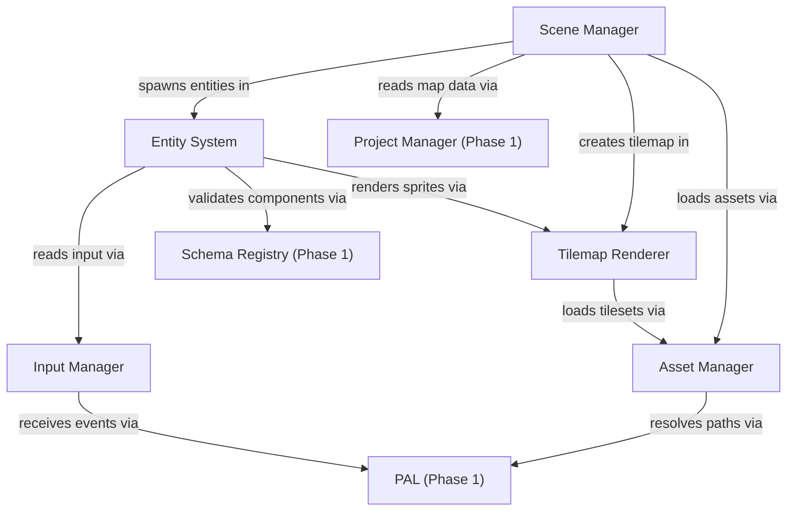

# Phase 2: Core Engine

> **Status**: Draft
> **Last updated**: 2026-04-16
> **Parent**: [00-overview.md](./00-overview.md)
> **Prerequisite**: Phase 1 (Foundation) complete

---

## Module 5: Asset Manager

### 5.1 Problem

Every engine subsystem needs textures, audio, sprite sheets, and tilesets. Without a centralized asset pipeline, each module loads and caches assets independently — leading to duplicated memory, inconsistent error handling, and no way to show loading progress.

### 5.2 Requirements

| ID | Requirement | Priority |
|---|---|---|
| AM-01 | Load all asset types through a single API: textures, sprite sheets, audio, tilesets, JSON data | Must |
| AM-02 | Built on PixiJS v8's `Assets` loader (no parallel loading system) | Must |
| AM-03 | Resolve asset paths through the PAL (`platform.fs.resolveAssetPath`) | Must |
| AM-04 | Reference counting — assets stay loaded while referenced, freed when unreferenced | Must |
| AM-05 | Asset manifest per project: a generated index of all assets with type metadata | Should |
| AM-06 | Loading progress callbacks for loading screens | Should |
| AM-07 | Hot-reload assets in editor mode (file watcher triggers re-load) | Should |
| AM-08 | Asset bundles for scene-scoped loading (load all assets a scene needs in one call) | Should |

### 5.3 Interface Design

```typescript
interface AssetManager {
  /**
   * Load a single asset by its project-relative path.
   * Returns the loaded resource (Texture, Spritesheet, AudioBuffer, etc.).
   * Caches by path — repeated calls return the cached instance.
   */
  load<T = unknown>(path: string): Promise<T>;

  /**
   * Load a bundle of assets, with progress reporting.
   * Used for scene transitions and loading screens.
   */
  loadBundle(paths: string[], onProgress?: (progress: number) => void): Promise<void>;

  /**
   * Release a reference to an asset. When refcount hits 0, the asset is unloaded.
   */
  unload(path: string): void;

  /**
   * Check if an asset is currently loaded.
   */
  isLoaded(path: string): boolean;

  /**
   * Get a previously loaded asset. Throws if not loaded.
   */
  get<T = unknown>(path: string): T;

  /**
   * In editor mode: force-reload an asset from disk (hot-reload).
   */
  reload(path: string): Promise<void>;
}
```

### 5.4 Asset Type Mapping

| File Extension | PixiJS Type | Loader |
|---|---|---|
| `.png`, `.jpg`, `.webp` | `Texture` | PixiJS `Assets.load()` |
| `.sprite.json` | `Spritesheet` | PixiJS spritesheet parser |
| `.tileset.json` | `TilesetData` (custom) | Custom parser → `@pixi/tilemap` |
| `.ogg`, `.mp3`, `.wav` | `AudioBuffer` | Web Audio API via PAL |
| `.json` | Parsed object | JSON parser |
| `.webm`, `.mp4` | `HTMLVideoElement` | Browser video loader |

### 5.5 Design Decisions

| Decision | Rationale |
|---|---|
| **Wrap PixiJS `Assets`, don't replace it** | PixiJS v8's loader handles caching, format detection, and multi-pack spritesheets. Adding reference counting and PAL integration on top is sufficient. |
| **Reference counting over manual dispose** | Scenes share assets (same tileset across multiple maps). Refcounting ensures shared assets survive scene transitions. |
| **Asset bundles tied to scenes** | RPG-style games load assets per-map. A scene declares its asset bundle; the Asset Manager preloads it during the transition. |

---

## Module 6: Map/Tilemap Renderer

### 6.1 Problem

The tilemap is the most visible part of any RPG. It needs to render efficiently (thousands of tiles per frame), support RPG Maker-style autotiling, and handle layered composition with passability data.

### 6.2 Requirements

| ID | Requirement | Priority |
|---|---|---|
| TR-01 | Render tile-based maps using `@pixi/tilemap` on PixiJS v8 | Must |
| TR-02 | Support 4 tile layers (matching RPG Maker MZ: base, detail, overlay, ceiling) | Must |
| TR-03 | Autotile system (A1–A4 categories: animated water, ground, buildings, walls) | Must |
| TR-04 | Tile passability flags: blocked, passable, star (renders above character), directional | Must |
| TR-05 | Camera system with smooth scrolling and player tracking | Must |
| TR-06 | Parallax background layer support | Should |
| TR-07 | Tile-level special flags: bush (semi-transparent lower sprite), ladder, counter, damage floor | Should |
| TR-08 | Support variable tile sizes (default 48×48, configurable per tileset) | Should |
| TR-09 | Render Layers (PixiJS v8 feature) for weather/overlay effects independent of scene graph | Should |

### 6.3 Map Data Model

```typescript
interface TilemapData {
  /** Unique map ID (matches filename slug). */
  id: string;
  /** Display name. */
  name: string;
  /** Dimensions in tiles. */
  width: number;
  height: number;
  /** Tile size in pixels. */
  tileWidth: number;
  tileHeight: number;
  /** Tileset IDs used by this map. */
  tilesets: string[];
  /** 4 tile layers, each a flat array of tile IDs (row-major). */
  layers: [TileLayer, TileLayer, TileLayer, TileLayer];
  /** Parallax background config. */
  parallax?: ParallaxConfig;
  /** Map-level properties (BGM, encounter rate, etc.). */
  properties: MapProperties;
}

interface TileLayer {
  /** Flat array: length = width × height. 0 = empty tile. */
  tiles: number[];
  /** Whether this layer is visible (editor toggle). */
  visible: boolean;
}

/** Per-tile passability stored in tileset metadata, not per-map. */
interface TilePassability {
  type: "blocked" | "passable" | "star";
  /** Directional overrides (for one-way passages, cliff edges). */
  directions?: {
    up?: boolean;
    down?: boolean;
    left?: boolean;
    right?: boolean;
  };
  flags?: ("bush" | "ladder" | "counter" | "damage")[];
}

interface ParallaxConfig {
  image: string;       // Asset path
  scrollX: number;     // Scroll speed multiplier relative to camera
  scrollY: number;
  loopX: boolean;
  loopY: boolean;
}

interface MapProperties {
  bgm?: { path: string; volume: number; pitch: number };
  encounterRate?: number;
  encounterList?: string[];   // Troop IDs
  displayName?: string;       // Shown on map entry
}
```

### 6.4 Autotile System

Mirrors RPG Maker MZ's approach:

| Category | Purpose | Behavior |
|---|---|---|
| **A1** | Animated tiles (water, lava) | 3-frame animation cycle, autotile edges |
| **A2** | Ground tiles (grass, dirt, stone) | Standard autotile with 47 edge/corner patterns |
| **A3** | Building tiles (walls, roofs) | Simplified autotile for architectural edges |
| **A4** | Wall tops | Vertical-face autotile for RPG dungeon walls |
| **B–E** | Decoration tiles | No autotile — placed as-is on layers 2–4 |

Each autotile cell is composited from four 24×24 mini-tiles (in a 48×48 grid), selected by analyzing the 8 surrounding tiles.

### 6.5 Camera System

```typescript
interface Camera {
  /** Center the camera on a world position. */
  lookAt(x: number, y: number): void;
  /** Follow an entity with optional smoothing. */
  follow(entityId: string, options?: CameraFollowOptions): void;
  /** Stop following. */
  unfollow(): void;
  /** Scroll by a delta (for cutscenes). */
  pan(dx: number, dy: number, duration: number, easing?: EasingFunction): Promise<void>;
  /** Shake effect (damage, earthquake). */
  shake(intensity: number, duration: number): Promise<void>;
  /** Current viewport bounds in world coordinates. */
  readonly viewport: Rectangle;
}

interface CameraFollowOptions {
  /** Smoothing factor (0 = instant snap, 1 = very slow catch-up). */
  smoothing?: number;
  /** Dead zone — camera doesn't move until the target moves this far from center. */
  deadZone?: Rectangle;
}
```

### 6.6 Design Decisions

| Decision | Rationale |
|---|---|
| **`@pixi/tilemap` for rendering** | Official PixiJS tilemap library, optimized batch rendering for WebGL/WebGPU. Avoid reinventing tile batching. |
| **RPG Maker-compatible layer model** | 4 layers match what RPG Maker users expect. Fewer is limiting; more is overwhelming for the target audience. |
| **Passability on tileset, not per-map** | Same tile has the same passability everywhere. Configured once in the tileset editor, applied to all maps using that tileset. Per-map overrides available via events. |
| **Flat tile arrays (row-major)** | Compact, fast indexing (`tiles[y * width + x]`), diffs well in Git (one line per row if formatted). |

---

## Module 7: Input Manager

### 7.1 Problem

The engine needs unified input handling across keyboard, mouse, touch, and gamepad — abstracted through the PAL so it works across export targets.

### 7.2 Requirements

| ID | Requirement | Priority |
|---|---|---|
| IM-01 | Keyboard input (key down, key up, key held) | Must |
| IM-02 | Gamepad support (buttons, analog sticks, D-pad) | Must |
| IM-03 | Action mapping — users bind abstract actions ("confirm", "cancel", "menu") to physical inputs | Must |
| IM-04 | Input consumed through PAL, not direct DOM events | Must |
| IM-05 | Mouse/touch input for editor and menu interaction | Must |
| IM-06 | Input buffering for frame-precise action detection | Should |
| IM-07 | Configurable key bindings (persisted in project config) | Should |
| IM-08 | Simultaneous keyboard + gamepad support | Should |

### 7.3 Interface Design

```typescript
interface InputManager {
  /** Check if an action is currently pressed this frame. */
  isActionPressed(action: string): boolean;
  /** Check if an action was just triggered this frame (rising edge). */
  isActionJustPressed(action: string): boolean;
  /** Check if an action was just released this frame (falling edge). */
  isActionJustReleased(action: string): boolean;
  /** Get analog axis value (-1 to 1). For D-pad/keys, returns -1, 0, or 1. */
  getAxis(axis: string): number;

  /** Register/override an action mapping. */
  bindAction(action: string, bindings: InputBinding[]): void;
  /** Get current bindings for an action. */
  getBindings(action: string): InputBinding[];

  /** Must be called once per game frame to update input state. */
  update(): void;
}

interface InputBinding {
  type: "keyboard" | "gamepad-button" | "gamepad-axis" | "mouse";
  /** Key code, button index, or axis index. */
  code: string | number;
  /** For axes: which direction is positive. */
  axisDirection?: "positive" | "negative";
}
```

### 7.4 Default Action Map

| Action | Keyboard | Gamepad |
|---|---|---|
| `move-up` | `ArrowUp`, `W` | D-pad Up, Left Stick Up |
| `move-down` | `ArrowDown`, `S` | D-pad Down, Left Stick Down |
| `move-left` | `ArrowLeft`, `A` | D-pad Left, Left Stick Left |
| `move-right` | `ArrowRight`, `D` | D-pad Right, Left Stick Right |
| `confirm` | `Enter`, `Space`, `Z` | A / Cross |
| `cancel` | `Escape`, `X` | B / Circle |
| `menu` | `Escape` | Start |
| `dash` | `Shift` | X / Square |
| `debug` | `F9` | — |

### 7.5 Design Decisions

| Decision | Rationale |
|---|---|
| **Action-based, not key-based** | Game logic checks `isActionPressed("confirm")`, never `isKeyDown("Enter")`. Decouples logic from hardware. |
| **Per-frame update model** | Input state is snapshotted once per frame. `justPressed`/`justReleased` only fire for one frame, preventing accidental double-triggers. |
| **Through PAL** | Web exports use DOM events; Electron uses IPC-forwarded events. The InputManager doesn't care — it receives normalized events from `platform.input`. |

---

## Module 8: Entity System

### 8.1 Problem

NPCs, the player, projectiles, visual effects — all are "entities" with different combinations of behavior. A rigid class hierarchy (`Player extends Character extends Entity`) becomes unmaintainable. An Entity Component System (ECS) provides the flexibility RPG games need.

### 8.2 Requirements

| ID | Requirement | Priority |
|---|---|---|
| ES-01 | Component-based entity architecture (ECS) | Must |
| ES-02 | Entities are plain data — fully serializable for save/load and multiplayer | Must |
| ES-03 | Built-in components for RPG primitives: Position, Sprite, Movement, Collision, EventTrigger | Must |
| ES-04 | Systems process entities with matching component sets each frame | Must |
| ES-05 | Entity queries: find all entities with a specific component combination | Must |
| ES-06 | Plugins can register custom components and systems | Must |
| ES-07 | React bindings for editor UI (inspect/edit entity components in real-time) | Should |
| ES-08 | Entity prefabs: reusable templates for common entity configurations | Should |

### 8.3 Technology Choice: Miniplex

**Miniplex** over bitECS. Rationale:

| Factor | Miniplex | bitECS |
|---|---|---|
| **Data model** | Object-based — entities are plain JS objects | Typed arrays — entities are numeric IDs |
| **Serialization** | `JSON.stringify()` works out of the box | Requires manual serialization of typed arrays |
| **React integration** | First-class React bindings | None |
| **DX** | Clean, intuitive API | Lower-level, steeper learning curve |
| **Performance** | Excellent for hundreds-to-thousands of entities | Optimized for tens of thousands |

RPG games rarely exceed a few hundred active entities per scene. Miniplex's object-based model aligns perfectly with the "single serializable state" architecture, and its React bindings simplify the editor's entity inspector.

### 8.4 Built-In Components

```typescript
// Position in the tile grid + sub-tile pixel offset
interface PositionComponent {
  tileX: number;
  tileY: number;
  offsetX: number;    // Sub-tile pixel offset (for smooth movement)
  offsetY: number;
  z: number;          // Layer ordering (bridges, flying entities)
}

// Visual representation
interface SpriteComponent {
  spriteSheet: string;   // Asset path to sprite sheet
  animation: string;     // Current animation name ("walk-down", "idle-left")
  frame: number;         // Current frame index
  visible: boolean;
  opacity: number;       // 0-1
  tint?: number;         // Color tint (hex)
}

// Grid-based movement
interface MovementComponent {
  speed: number;           // Tiles per second
  direction: Direction;    // "up" | "down" | "left" | "right"
  isMoving: boolean;
  moveRoute?: MoveRoute;  // Scripted movement path
  canDash: boolean;
  throughWalls: boolean;   // Bypass collision (ghosts, debug)
}

// Collision with tiles and other entities
interface CollisionComponent {
  solid: boolean;           // Blocks other entities from occupying the same tile
  triggerOnTouch: boolean;  // Fires event when another entity touches this one
  triggerOnAction: boolean; // Fires event when player presses "confirm" facing this
}

// Link to event chain
interface EventTriggerComponent {
  eventId: string;          // References an event chain in the project
  trigger: "action" | "touch" | "autorun" | "parallel";
  conditions?: EventCondition[];
}

// NPC-specific data
interface CharacterComponent {
  name: string;
  portrait?: string;        // Asset path to face graphic
  movePattern: "fixed" | "random" | "follow" | "custom";
  directionFix: boolean;    // Prevent direction change during movement
}
```

### 8.5 Built-In Systems

| System | Processes | Responsibility |
|---|---|---|
| **MovementSystem** | `Position` + `Movement` | Update position based on movement state, handle tile-to-tile transitions |
| **CollisionSystem** | `Position` + `Collision` | Check tile passability and entity-entity collision |
| **SpriteSystem** | `Position` + `Sprite` | Sync PixiJS sprite position/animation with component data |
| **AnimationSystem** | `Sprite` | Advance animation frames based on elapsed time |
| **EventTriggerSystem** | `Position` + `EventTrigger` + `Collision` | Detect trigger conditions and fire events |
| **CameraSystem** | `Position` (player) | Update camera position to follow the player entity |

### 8.6 Design Decisions

| Decision | Rationale |
|---|---|
| **Miniplex ECS** | Object-based entities serialize naturally to JSON. React bindings power the editor's entity inspector. Performance is more than sufficient for RPG-scale entity counts. |
| **Grid-based movement with sub-tile offset** | RPG Maker-style: entities move tile-to-tile, but the visual position interpolates smoothly. Movement is discrete (simplifies collision), rendering is continuous (looks smooth). |
| **Components are plain interfaces, not classes** | Serializable, testable, no hidden state. Systems contain logic; components contain data. |
| **Plugins register components and systems** | A crafting plugin adds `CraftingStation` component + `CraftingSystem`. The ECS is the primary extension point for runtime plugins. |

---

## Module 9: Scene Manager

### 9.1 Problem

RPG games consist of distinct scenes: maps, battles, menus, title screen, cutscenes. The Scene Manager handles transitions between them — loading/unloading assets, setting up entities, and managing the scene lifecycle.

### 9.2 Requirements

| ID | Requirement | Priority |
|---|---|---|
| SM-01 | Scene lifecycle: `init` → `enter` → `update` (per frame) → `exit` → `destroy` | Must |
| SM-02 | Scene stack: push/pop scenes (e.g. push menu over active map, pop to resume) | Must |
| SM-03 | Scene transitions with visual effects (fade, slide, custom) | Must |
| SM-04 | Asset preloading: load a scene's asset bundle before entering | Must |
| SM-05 | Scene type registry: map scenes, battle scenes, menu scenes, custom plugin scenes | Must |
| SM-06 | Pass data between scenes (e.g. which map to load, battle parameters) | Must |
| SM-07 | Parallel scenes: run a scene in the background (ambient audio, weather) while another is active | Should |

### 9.3 Interface Design

```typescript
interface SceneManager {
  /** Replace the current scene. */
  switchTo<T>(sceneType: string, params: T, transition?: TransitionConfig): Promise<void>;
  /** Push a scene on top of the current one (e.g. menu over map). */
  push<T>(sceneType: string, params: T, transition?: TransitionConfig): Promise<void>;
  /** Pop the top scene, returning to the one below. */
  pop(transition?: TransitionConfig): Promise<void>;
  /** Get the currently active (top) scene. */
  current(): Scene | null;
  /** Get the full scene stack. */
  stack(): readonly Scene[];
}

interface Scene {
  readonly type: string;

  /** Called once when the scene is created. Load assets here. */
  init(params: unknown): Promise<void>;
  /** Called when the scene becomes the active (top) scene. */
  enter(): void;
  /** Called every game frame while this scene is active. */
  update(dt: number): void;
  /** Called when another scene is pushed on top (scene pauses). */
  pause(): void;
  /** Called when this scene returns to the top after a pop. */
  resume(): void;
  /** Called when the scene is being removed from the stack. */
  exit(): void;
  /** Called after exit for cleanup. */
  destroy(): void;
}

interface TransitionConfig {
  type: "fade" | "slide" | "none" | string;   // string for custom plugin transitions
  duration: number;                             // milliseconds
  color?: number;                               // fade color (default black)
  direction?: "left" | "right" | "up" | "down"; // slide direction
}
```

### 9.4 Built-In Scene Types

| Type ID | Purpose | Parameters |
|---|---|---|
| `map` | Overworld/dungeon map | `{ mapId: string, spawnX: number, spawnY: number }` |
| `battle` | Turn-based battle encounter | `{ troopId: string, canEscape: boolean, bgm?: string }` |
| `title` | Title screen (new game, load, options) | None |
| `game-over` | Game over screen | `{ canRetry: boolean }` |
| `menu` | Pause/inventory menu (pushed over map) | `{ tab?: string }` |

### 9.5 Scene Transition Flow

```
switchTo("map", { mapId: "village-inn", spawnX: 5, spawnY: 8 })
    │
    ▼
  Current scene: exit() → destroy()
    │
    ▼
  Transition out (e.g. fade to black)
    │
    ▼
  New scene: init({ mapId, spawnX, spawnY })
    ├── Load asset bundle for village-inn map
    ├── Create tilemap from map data
    └── Spawn entities from map events
    │
    ▼
  Transition in (e.g. fade from black)
    │
    ▼
  New scene: enter()
    │
    ▼
  Game loop calls: update(dt) every frame
```

### 9.6 Design Decisions

| Decision | Rationale |
|---|---|
| **Stack-based** | RPGs constantly layer UIs: map → menu → item selection → confirmation dialog. A stack makes push/pop natural. |
| **Async lifecycle** | `init` is async because asset loading is async. Transitions wait for `init` to complete before animating in. |
| **Scene types are registered** | Plugins can register custom scene types (e.g. a crafting scene, a fishing minigame). The Scene Manager doesn't hardcode the list. |
| **Transition as config, not class** | Simple transitions (fade, slide) are declarative. Complex transitions can be registered as custom types by plugins. |

---

## Cross-Module Dependencies



**Build order within Phase 2:**
1. **Asset Manager** — everything else needs to load assets
2. **Tilemap Renderer** — most visible proof-of-concept; needs Asset Manager
3. **Input Manager** — independent of renderer, but needed before entities can move
4. **Entity System** — needs renderer for sprites, input for movement
5. **Scene Manager** — orchestrates all of the above

---

## Acceptance Criteria

Phase 2 is complete when:

- [ ] Assets (textures, sprite sheets, audio) load through the Asset Manager and are cached with reference counting
- [ ] A tile map renders with 4 layers, autotile edges resolve correctly for A2 ground tiles
- [ ] Camera follows the player entity with smooth scrolling
- [ ] Keyboard and gamepad input both map to abstract actions ("confirm", "move-up", etc.)
- [ ] Entities with Position + Sprite + Movement components move tile-to-tile with smooth interpolation
- [ ] Collision system respects tile passability flags and solid entities
- [ ] Scene transitions work: fade from title screen → map scene with preloaded assets
- [ ] A menu scene can be pushed over the map scene, then popped to resume
- [ ] All entity components serialize to JSON and deserialize back without data loss
- [ ] The full engine update loop runs against `MockPlatform` in a headless test
