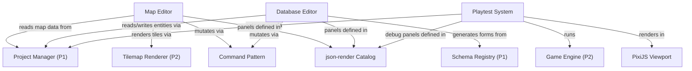

# Phase 3: Core Editor

> **Status**: Draft
> **Last updated**: 2026-04-16
> **Parent**: [00-overview.md](./00-overview.md)
> **Prerequisite**: Phase 1 (Foundation) + Phase 2 (Core Engine)

This is the first phase where the json-render catalog drives the UI. All editor panels described here are catalog components rendered from schema-constrained JSON — both for consistency and to establish the pattern plugins will follow.

---

## Module 10: Map Editor

### 10.1 Problem

The map editor is the most-used tool in any RPG creator. Users need to paint tiles, place events, configure map properties, and preview their work — all in a single, fluid interface. RPG Maker MZ's map editor is the UX benchmark; Eternity must match its ease while adding Git-friendly output and extensibility.

### 10.2 Requirements

| ID | Requirement | Priority |
|---|---|---|
| ME-01 | Tile painting on 4 layers with pencil, rectangle, ellipse, flood fill tools | Must |
| ME-02 | Tile palette panel (tabs A–E) showing the map's assigned tilesets | Must |
| ME-03 | Autotile preview — painted tiles resolve autotile edges in real-time | Must |
| ME-04 | Map/Event mode toggle — switch between tile painting and event placement | Must |
| ME-05 | Event placement: create, move, delete, duplicate events on the map grid | Must |
| ME-06 | Map tree panel showing the project's map hierarchy (world → region → room) | Must |
| ME-07 | Map properties dialog (dimensions, tileset, BGM, parallax, encounter settings) | Must |
| ME-08 | Layer visibility toggles and active layer selection | Must |
| ME-09 | Grid overlay toggle | Must |
| ME-10 | Passability overlay (visualize blocked/passable/star tiles) | Should |
| ME-11 | Shadow pen tool (paint shadows along walls/objects) | Should |
| ME-12 | Eyedropper tool (pick tile from map to palette selection) | Should |
| ME-13 | Shift-map: copy/paste map regions preserving autotile edges | Should |
| ME-14 | Minimap panel for large maps | Should |
| ME-15 | Quick-event templates (door, treasure chest, teleport) | Should |
| ME-16 | All operations go through Command pattern (undoable) | Must |

### 10.3 Editor Layout

```
┌──────────────────────────────────────────────────────────────┐
│  Toolbar: [Map|Event] [Pencil|Rect|Ellipse|Fill|Shadow|Eye] │
│           [Layer 1|2|3|4] [Grid] [Passability] [Zoom]       │
├────────────┬──────────────────────────────┬──────────────────┤
│            │                              │                  │
│  Map Tree  │       Map Viewport           │  Tile Palette    │
│            │     (PixiJS v8 canvas)       │  (Tabs A–E)     │
│  ├ World   │                              │                  │
│  │ ├ Town  │   Rendered tilemap with      │  ┌──┬──┬──┬──┐  │
│  │ │ ├ Inn │   grid overlay, camera       │  │  │  │  │  │  │
│  │ │ └ Shop│   controls, cursor           │  ├──┼──┼──┼──┤  │
│  │ └ Field │                              │  │  │  │  │  │  │
│  └ Dungeon │                              │  └──┴──┴──┴──┘  │
│            │                              │                  │
├────────────┴──────────────────────────────┴──────────────────┤
│  Properties panel (map or selected event)                    │
└──────────────────────────────────────────────────────────────┘
```

### 10.4 json-render Catalog Components

These editor panels are all catalog entries, renderable from JSON specs:

```typescript
// Map editor catalog components
const mapEditorCatalog = {
  MapTree: {
    props: z.object({
      maps: z.array(z.object({ id: z.string(), name: z.string(), children: z.array(z.string()) })),
      selectedMapId: z.string().optional(),
    }),
    description: "Hierarchical map list with drag-and-drop reordering.",
  },
  TilePalette: {
    props: z.object({
      tilesetId: z.string(),
      activeTab: z.enum(["A", "B", "C", "D", "E"]),
      selectedTiles: z.array(z.number()),
    }),
    description: "Tile selection grid with tab navigation.",
  },
  MapProperties: {
    props: z.object({
      mapId: z.string(),
      schemaId: z.literal("eternity:map"),
    }),
    description: "Map settings form: dimensions, tileset, BGM, parallax.",
  },
  EventList: {
    props: z.object({
      mapId: z.string(),
      events: z.array(z.object({ id: z.string(), name: z.string(), x: z.number(), y: z.number() })),
    }),
    description: "List of events on the current map (shown in Event mode).",
  },
};
```

### 10.5 Command Examples

| Command | Execute | Undo |
|---|---|---|
| `PaintTilesCommand` | Write tile IDs to layer at coordinates | Restore previous tile IDs |
| `FloodFillCommand` | Fill contiguous region with tile | Restore all overwritten tiles |
| `ResizeMapCommand` | Change dimensions, pad/crop tile arrays | Restore previous dimensions and data |
| `MoveEventCommand` | Update event position | Restore previous position |
| `CreateEventCommand` | Create event file on disk | Delete event file |
| `ChangeMapPropertyCommand` | Update map config field | Restore previous value |

### 10.6 Design Decisions

| Decision | Rationale |
|---|---|
| **PixiJS viewport for map canvas, React for surrounding panels** | The map viewport needs hardware-accelerated tile rendering. All other panels (tree, palette, properties) are standard React UI driven by json-render. |
| **RPG Maker-compatible toolbar** | Users migrating from RPG Maker should recognize the tool set immediately. Same tools, same keyboard shortcuts where possible. |
| **Map tree with drag-and-drop** | Enables organizing maps into logical hierarchies. Modifies `_index.json` only — the map data files themselves don't change. |
| **Quick-event templates** | RPG Maker's "Quick Event" feature drastically reduces boilerplate for doors, chests, and teleporters. Eternity replicates this as pre-built event templates. |

---

## Module 11: Database Editor

### 11.1 Problem

RPG games are data-heavy: actors, classes, items, skills, enemies, equipment, status effects, and more. The Database Editor provides a structured interface for creating and editing all of these — without users needing to touch JSON files directly. Since all entity types are defined by the Schema Registry, the Database Editor is fundamentally a **schema-driven form generator**.

### 11.2 Requirements

| ID | Requirement | Priority |
|---|---|---|
| DB-01 | Category sidebar listing all entity types (actors, items, skills, etc.) | Must |
| DB-02 | Entity list for the selected category (scrollable, searchable) | Must |
| DB-03 | Property editor generated from the entity's Schema Registry schema | Must |
| DB-04 | Create, duplicate, delete entities | Must |
| DB-05 | All edits go through Command pattern (undoable) | Must |
| DB-06 | Inline asset pickers (select portrait, sprite, audio from project assets) | Must |
| DB-07 | Cross-entity reference pickers (select class for actor, item for drop table) | Must |
| DB-08 | Validation feedback — show Schema Registry validation errors inline | Must |
| DB-09 | Plugin entity types appear alongside built-in types (from Schema Registry) | Must |
| DB-10 | Batch editing — select multiple entities, edit shared fields | Should |
| DB-11 | Search/filter within entity lists | Should |
| DB-12 | Stat curve editor for level-based progression (HP, MP, ATK per level) | Should |
| DB-13 | Damage formula editor with live preview | Should |

### 11.3 Editor Layout

```
┌──────────────────────────────────────────────────────────────┐
│  Database Editor                                             │
├──────────┬─────────────┬─────────────────────────────────────┤
│          │             │                                     │
│ Category │ Entity List │ Property Editor                     │
│          │             │                                     │
│ Actors   │ > Hero      │ Name: [Hero                ]       │
│ Classes  │   Merchant  │ Class: [Warrior         ▾]         │
│ Items    │   Bandit    │ Initial Level: [1  ]                │
│ Skills   │             │ Max Level: [99 ]                    │
│ Enemies  │ [+ New]     │ Portrait: [hero.png     📁]        │
│ Weapons  │ [Search...] │ Sprite: [hero-walk      📁]        │
│ Armor    │             │                                     │
│ States   │             │ ── Base Stats ──                    │
│ ──────── │             │ HP:  [450 ] ████████████░░  curve↗  │
│ (plugin) │             │ MP:  [80  ] ████░░░░░░░░░░  curve↗  │
│ Recipes  │             │ ATK: [25  ] ██████░░░░░░░░  curve↗  │
│          │             │ DEF: [20  ] █████░░░░░░░░░  curve↗  │
│          │             │                                     │
│          │             │ ── Equipment ──                      │
│          │             │ Weapon: [Iron Sword      ▾]         │
│          │             │ Shield: [None            ▾]         │
│          │             │                                     │
│          │             │ [⚠ 1 validation warning]            │
└──────────┴─────────────┴─────────────────────────────────────┘
```

### 11.4 Schema-Driven Form Generation

The property editor is **generated from Zod schemas**, not hand-coded per entity type. This is the key integration between the Schema Registry and json-render:

```typescript
// 1. Schema Registry defines the shape
const actorSchema = z.object({
  class: z.string(),            // → renders as EntityReferencePicker (filtered to "class" type)
  initialLevel: z.number().min(1).max(99),  // → renders as NumberInput with min/max
  maxLevel: z.number().min(1).max(99),
  baseStats: z.object({
    hp: z.number().min(0),      // → renders as NumberInput + stat curve button
    mp: z.number().min(0),
    attack: z.number().min(0),
    defense: z.number().min(0),
  }),
  equipment: z.object({
    weapon: z.string().nullable(),  // → renders as EntityReferencePicker (filtered to "weapon")
    shield: z.string().nullable(),
    // ...
  }),
  portrait: z.string(),         // → renders as AssetPicker (filtered to faces/)
  sprite: z.string(),           // → renders as AssetPicker (filtered to characters/)
});

// 2. json-render catalog maps Zod types to editor widgets
const databaseCatalog = {
  PropertyEditor: {
    props: z.object({
      schemaId: z.string(),
      entityId: z.string(),
      data: z.unknown(),
    }),
    description: "Auto-generated form from a Schema Registry schema.",
  },
  EntityReferencePicker: {
    props: z.object({
      targetType: z.string(),
      currentValue: z.string().nullable(),
      allowNull: z.boolean(),
    }),
    description: "Dropdown to select an entity of a specific type.",
  },
  AssetPicker: {
    props: z.object({
      assetDirectory: z.string(),
      fileTypes: z.array(z.string()),
      currentValue: z.string(),
    }),
    description: "File picker filtered to a specific asset directory.",
  },
  StatCurveEditor: {
    props: z.object({
      baseStat: z.number(),
      maxLevel: z.number(),
      curveData: z.array(z.number()),
    }),
    description: "Visual curve editor for level-based stat progression.",
  },
};
```

### 11.5 Zod-to-Widget Mapping

| Zod Type | Widget | Notes |
|---|---|---|
| `z.string()` | `TextInput` | |
| `z.string().nullable()` with entity ref annotation | `EntityReferencePicker` | Dropdown filtered by target type |
| `z.number()` | `NumberInput` | |
| `z.number().min(a).max(b)` | `NumberInput` with range | Shows min/max constraints |
| `z.boolean()` | `Checkbox` | |
| `z.enum([...])` | `Select` dropdown | Options from enum values |
| `z.array(z.object({...}))` | `ArrayEditor` | Add/remove/reorder rows |
| `z.object({...})` | `FieldGroup` | Collapsible section |
| String field with `.describe("asset:faces/")` | `AssetPicker` | Filtered to described directory |

Custom annotations on Zod schemas (via `.describe()` or Zod metadata) control which widget renders. This is how the same schema powers both data validation and UI generation.

### 11.6 Design Decisions

| Decision | Rationale |
|---|---|
| **Schema-driven forms, not hand-coded** | Adding a new entity type (built-in or plugin) automatically gets an editor UI. No per-type React code needed. |
| **Zod annotations for widget hints** | Schemas already exist for validation. Adding `.describe("asset:faces/")` is minimal metadata that unlocks the right picker widget. |
| **Plugin types in the same sidebar** | A crafting plugin's "Recipes" category appears alongside built-in "Items" and "Skills". The editor doesn't distinguish between engine and plugin entity types. |
| **Inline validation** | `safeParse` runs on every edit. Errors appear inline next to the invalid field, not as a modal dialog. Users fix problems as they go. |

---

## Module 12: Playtest System

### 12.1 Problem

Users need to playtest their game instantly from within the editor — launch the game from a specific map position, see changes without a full project reload, and switch back to editing seamlessly. RPG Maker's F5-to-playtest workflow is the standard.

### 12.2 Requirements

| ID | Requirement | Priority |
|---|---|---|
| PT-01 | Launch playtest from the current map at a specified position | Must |
| PT-02 | Playtest runs the game engine in the same Electron window (embedded viewport) | Must |
| PT-03 | Auto-save all dirty entities before playtest starts | Must |
| PT-04 | Stop playtest and return to editor (preserving editor state) | Must |
| PT-05 | F5 shortcut to start playtest, Escape/F5 to stop | Must |
| PT-06 | Playtest from player start position (as defined in `system.json`) | Must |
| PT-07 | Playtest from cursor position on current map (right-click → "Playtest from here") | Should |
| PT-08 | Debug overlay: FPS counter, entity count, current map info | Should |
| PT-09 | Console panel for script output and engine warnings during playtest | Should |
| PT-10 | Hot-reload: detect entity changes during playtest and reload without restarting | Could |
| PT-11 | Playtest save data stored in `.eternity/playtest/`, separate from real saves | Must |

### 12.3 Playtest Flow

```
User presses F5 (or clicks Playtest button)
        │
        ▼
  Auto-save all dirty entities
        │
        ▼
  Determine start position:
  ├── Default: system.json → start_map + starting_party
  ├── Current map: current map + specified coordinates
  └── Cursor: current map + cursor tile position
        │
        ▼
  Switch editor layout to playtest mode:
  ├── Main viewport → game canvas (PixiJS)
  ├── Sidebar → debug panel (console, FPS, entity list)
  └── Toolbar → playtest controls (stop, restart, debug tools)
        │
        ▼
  Initialize game engine:
  ├── Create scene manager
  ├── Load starting map scene
  ├── Spawn player entity at start position
  └── Begin game loop
        │
        ▼
  Game runs... user plays...
        │
        ▼
  User presses F5 or Stop button
        │
        ▼
  Teardown game engine:
  ├── Save playtest data to .eternity/playtest/
  ├── Destroy all scenes and entities
  └── Unload playtest-only assets
        │
        ▼
  Restore editor layout to pre-playtest state
```

### 12.4 Playtest vs. Exported Game

| Aspect | Playtest Mode | Exported Game |
|---|---|---|
| **Platform** | ElectronPlatform (editor) | Target platform |
| **Asset loading** | Direct from project directory | Bundled assets |
| **Save location** | `.eternity/playtest/` | User's save directory |
| **Debug tools** | Available (F9 console, overlays) | Stripped |
| **Hot-reload** | Supported (watches project files) | Not applicable |
| **Performance** | May be slightly slower (dev tools, file watching) | Optimized |

### 12.5 Debug Panel

Available during playtest via F9 or the debug toolbar:

| Panel | Shows |
|---|---|
| **Console** | Script output, engine warnings, event trace |
| **Variables** | Game variables and switches (RPG Maker-style global state) |
| **Entity Inspector** | Select an entity in the viewport, see all its components |
| **Map Info** | Current map ID, dimensions, active events, tile under cursor |
| **Performance** | FPS, draw calls, entity count, asset memory usage |

### 12.6 Design Decisions

| Decision | Rationale |
|---|---|
| **Same-window playtest** | Opening a separate window breaks flow. The editor viewport becomes the game viewport, with a toolbar to stop/restart. |
| **Auto-save before playtest** | Playtest uses the engine, which reads from disk via the Project Manager. Unsaved changes would be invisible during playtest. |
| **Separate playtest saves** | Playtest save data must never overwrite real player saves in an exported game. `.eternity/playtest/` is gitignored. |
| **Debug panel as json-render components** | The debug panels (console, variables, entity inspector) are catalog components. Plugins can register additional debug panels. |

---

## Cross-Module Dependencies



**Build order within Phase 3:**
1. **Map Editor** — builds directly on the tilemap renderer, most visible progress
2. **Database Editor** — builds on Schema Registry, independent of map editor
3. **Playtest System** — requires both editors to have content worth testing

---

## Acceptance Criteria

Phase 3 is complete when:

- [ ] Tile painting works on all 4 layers with pencil, rectangle, and flood fill tools
- [ ] Autotile edges resolve correctly when painting A2 ground tiles
- [ ] Map tree shows the project's map hierarchy, with create/rename/delete/reorder
- [ ] Events can be created, placed, moved, and deleted on a map in Event mode
- [ ] All map editor operations are undoable via Ctrl+Z
- [ ] Database Editor shows all built-in entity categories in the sidebar
- [ ] Selecting an entity type and creating a new entity generates a form from the Schema Registry schema
- [ ] Editing an entity field produces a Command, which can be undone
- [ ] A plugin-registered entity type (e.g. "Recipe") appears in the Database Editor sidebar with a working form
- [ ] Validation errors from the Schema Registry display inline in the property editor
- [ ] F5 starts playtest from the player start position, F5 again stops it
- [ ] Playtest saves go to `.eternity/playtest/`, not the project's save directory
- [ ] Debug panel shows FPS, entity count, and console output during playtest
