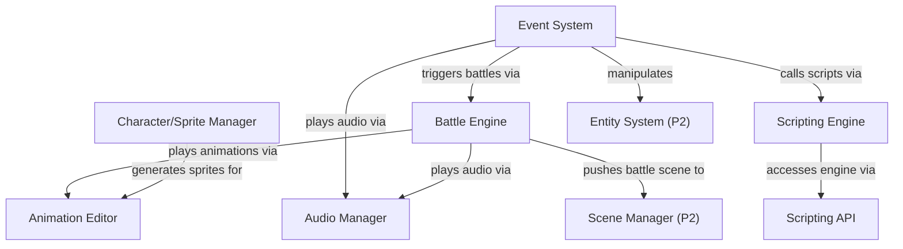

# Phase 4: Game Logic

> **Status**: Draft
> **Last updated**: 2026-04-16
> **Parent**: [00-overview.md](./00-overview.md)
> **Prerequisite**: Phases 1–3 complete

---

## Module 13: Event System

### 13.1 Problem

RPG games are driven by scripted events: NPC dialogue, cutscenes, treasure chests, doors, conditional story progression. RPG Maker's event command system is the gold standard for non-programmer accessibility. Eternity needs an equivalent — a list of sequential commands that can branch, loop, and manipulate game state.

### 13.2 Requirements

| ID | Requirement | Priority |
|---|---|---|
| EV-01 | Event commands: sequential list of instructions (Show Text, Conditional Branch, Set Variable, etc.) | Must |
| EV-02 | Trigger types: action button, player touch, autorun, parallel | Must |
| EV-03 | Event pages with conditions (switch/variable state determines which page is active) | Must |
| EV-04 | Game variables (numbered global state) and switches (boolean flags) | Must |
| EV-05 | Self-switches (per-event boolean flags, e.g. "treasure already opened") | Must |
| EV-06 | Common events (reusable event chains callable from any map event) | Must |
| EV-07 | Movement routes (scripted entity movement with wait-for-completion) | Must |
| EV-08 | Show Choices command (player picks from a list, branches per choice) | Must |
| EV-09 | Control flow: Label/Jump, Loop/Break, Wait, Comment | Must |
| EV-10 | Game state manipulation: Change Party, Change Items, Change Gold, Transfer Player | Must |
| EV-11 | Events stored as individual JSON files per the Project Format | Must |
| EV-12 | Plugin-defined custom event commands | Should |

### 13.3 Event Command Categories

Mirroring RPG Maker MZ's command tabs:

| Category | Commands |
|---|---|
| **Message** | Show Text, Show Choices, Show Scrolling Text, Input Number, Select Item |
| **Flow Control** | Conditional Branch, Loop, Break Loop, Label, Jump to Label, Comment, Wait |
| **Game State** | Control Switches, Control Variables, Control Self-Switch, Control Timer |
| **Party** | Change Gold, Change Items, Change Weapons, Change Armor, Change Party Member |
| **Actor** | Change HP, Change MP, Change State, Change EXP, Change Level, Change Equipment, Change Name |
| **Movement** | Set Movement Route, Transfer Player, Set Vehicle Location, Scroll Map |
| **Character** | Set Event Location, Change Transparency, Change Direction, Show Animation, Show Balloon |
| **Screen** | Fadeout/Fadein, Tint Screen, Flash Screen, Shake Screen, Wait |
| **Audio** | Play BGM, Play BGS, Play ME, Play SE, Stop All |
| **Scene** | Battle Processing, Shop Processing, Name Input, Open Menu, Open Save, Game Over |
| **System** | Change Battle BGM, Change Victory ME, Change Window Skin, Change Encounter, Change Map Name Display |
| **Script** | Run Script (text scripting sandbox), Plugin Command |

### 13.4 Event Data Model

```typescript
interface EventChain {
  id: string;
  name: string;
  pages: EventPage[];
}

interface EventPage {
  conditions: PageCondition[];
  graphic: { sprite?: string; direction?: Direction };
  movePattern: "fixed" | "random" | "approach" | "custom";
  trigger: "action" | "touch" | "autorun" | "parallel";
  commands: EventCommand[];
}

interface EventCommand {
  code: string;           // e.g. "show-text", "conditional-branch"
  indent: number;         // Nesting depth (for branches/loops)
  params: Record<string, unknown>;  // Command-specific parameters
}

// Example: Show Text command
// { code: "show-text", indent: 0, params: { face: "hero.png", text: "Hello!", position: "bottom" } }

// Example: Conditional Branch
// { code: "conditional-branch", indent: 0, params: { type: "switch", switchId: 1, value: true } }
// { code: "show-text", indent: 1, params: { text: "Door is open!" } }
// { code: "else", indent: 0, params: {} }
// { code: "show-text", indent: 1, params: { text: "Door is locked." } }
// { code: "end-conditional", indent: 0, params: {} }
```

### 13.5 Event Editor UI

The Event Editor is a json-render catalog panel showing a command list with indentation:

```
┌──────────────────────────────────────────────┐
│ Event: Old Man NPC                           │
│ Page: 1 of 2  [Conditions: Switch[1] = ON]  │
├──────────────────────────────────────────────┤
│ ◆ Show Text: Elder (face)                   │
│ :  "Welcome, traveler."                     │
│ ◆ Show Choices: [Yes] [No]                  │
│   ◆ When [Yes]:                             │
│     ◆ Change Items: +1 Potion               │
│     ◆ Control Self-Switch: A = ON           │
│   ◆ When [No]:                              │
│     ◆ Show Text: "Come back anytime."       │
│ ◆ End                                       │
├──────────────────────────────────────────────┤
│ [+ Add Command]  [Delete]  [Move ↑↓]        │
└──────────────────────────────────────────────┘
```

### 13.6 Design Decisions

| Decision | Rationale |
|---|---|
| **Command list, not node graph (for this tier)** | RPG Maker's linear command list is more accessible than a node graph for simple dialogue/events. The node graph is the Scripting Engine (Module 14) for advanced users. |
| **String command codes, not numeric** | `"show-text"` is more readable than `101` in JSON diffs. Plugins register commands by string key. |
| **Event pages with conditions** | RPG Maker pattern: an NPC's behavior changes based on story progress. Page conditions determine which set of commands is active. |
| **Plugin commands** | Plugins register custom commands (e.g. `"crafting:open-station"`) that appear in the command picker alongside built-in ones. |

---

## Module 14: Scripting Engine

### 14.1 Problem

The event command system covers 80% of RPG scripting needs. The remaining 20% — custom battle formulas, procedural generation, complex AI, modding — requires a real programming language. Eternity provides a two-tier scripting system: visual node graph + text scripting sandbox.

### 14.2 Requirements

| ID | Requirement | Priority |
|---|---|---|
| SC-01 | Visual event editor: node graph for complex event logic | Must |
| SC-02 | Text scripting sandbox: TypeScript-based, isolated from Node/Electron APIs | Must |
| SC-03 | Scripting API exposing engine systems (entities, variables, maps, battles) | Must |
| SC-04 | Scripts stored as `.ts` files in the project's `scripts/` directory | Must |
| SC-05 | Callable from event commands via "Run Script" command | Must |
| SC-06 | Live error reporting during playtest (errors shown in debug console) | Must |
| SC-07 | Visual node graph serialized as JSON (same format as events, different editor) | Must |
| SC-08 | Script autocompletion and type hints in the text editor | Should |
| SC-09 | Sandboxing: scripts cannot access filesystem, network, or Electron APIs | Must |

### 14.3 Two-Tier Architecture

```
Tier 1: Visual Scripting (Node Graph)
┌─────────────────────────────────────────────┐
│  [On Player Enter] ──► [Check Variable] ──► │
│                         ├─ true ──► [Spawn Boss]
│                         └─ false ─► [Show Hint]
└─────────────────────────────────────────────┘
  Serialized as JSON. No code written by the user.
  Uses React Flow for the graph UI.

Tier 2: Text Scripting (TypeScript Sandbox)
┌─────────────────────────────────────────────┐
│  // scripts/custom-damage.ts                │
│  export function damage(a: Actor, b: Actor) │
│    return a.atk * 4 - b.def * 2;            │
│  }                                          │
└─────────────────────────────────────────────┘
  Real TypeScript. Compiled + sandboxed at runtime.
  Called from events via "Run Script" command.
```

### 14.4 Visual Node Types

| Category | Nodes |
|---|---|
| **Triggers** | On Map Enter, On Battle Start, On Item Used, On Variable Changed, On Timer |
| **Conditions** | If Switch, If Variable, If Has Item, If Actor State, If Random % |
| **Actions** | Show Text, Change Variable, Add Item, Transfer Player, Play Sound, Start Battle |
| **Flow** | Branch, Merge, Loop, Delay, Sequence |
| **Data** | Get Variable, Get Actor Stat, Get Item Count, Constant, Math Operation |

### 14.5 Text Scripting API Surface

```typescript
// Available to user scripts in the sandbox
declare namespace Eternity {
  /** Game variables and switches. */
  const vars: { get(id: number): number; set(id: number, value: number): void };
  const switches: { get(id: number): boolean; set(id: number, value: boolean): void };

  /** Entity access. */
  function getPlayer(): Entity;
  function getEntity(id: string): Entity | null;
  function getEntitiesWithComponent<T>(component: string): Entity[];

  /** Party and inventory. */
  const party: { members(): Actor[]; addItem(id: string, count: number): void; gold(): number };

  /** Map interaction. */
  const map: { current(): MapInfo; transferPlayer(mapId: string, x: number, y: number): void };

  /** Audio. */
  const audio: { playBGM(path: string, volume?: number): void; playSE(path: string): void };

  /** UI. */
  function showText(text: string, face?: string): Promise<void>;
  function showChoices(choices: string[]): Promise<number>;
}
```

### 14.6 Technology Choice: React Flow

**React Flow** for the visual node graph. It's the industry standard for React-based node editors, provides first-class TypeScript support, and custom node rendering lets us embed RPG-specific UI (dialogue previews, item pickers) inside graph nodes.

### 14.7 Sandbox Technology (TBD)

The text scripting sandbox remains an open question (see [00-overview.md](./00-overview.md) §8). Candidates under evaluation:

| Option | Pros | Cons |
|---|---|---|
| **Web Workers** | Native browser API, message-passing isolation, no dependencies | Limited API surface, async-only communication |
| **QuickJS (WASM)** | True isolation, synchronous execution, small footprint | Separate runtime (not standard TS/JS), integration complexity |
| **V8 Isolates** | Same engine as Node.js, full JS compatibility | Electron-specific, won't work in web export |

Decision deferred until implementation begins. All three options can implement the same `Eternity.*` API surface.

---

## Module 15: Battle Engine

### 15.1 Problem

Turn-based combat is the core gameplay loop for most RPGs. The Battle Engine must support RPG Maker-style encounters (party vs. troop), damage formulas, skills, items, and state effects — while being extensible enough for custom battle systems.

### 15.2 Requirements

| ID | Requirement | Priority |
|---|---|---|
| BE-01 | Turn-based battle flow: input phase → action phase → turn end | Must |
| BE-02 | Party vs. enemy troop composition | Must |
| BE-03 | Actions: Attack, Defend, Skills, Items, Escape | Must |
| BE-04 | Skill targeting: single enemy, all enemies, single ally, all allies, self | Must |
| BE-05 | Damage formulas defined per-skill (evaluated as scripted expressions) | Must |
| BE-06 | Status effects (states): poison, sleep, stun, buffs/debuffs with turn durations | Must |
| BE-07 | Enemy AI patterns (random weighted action selection) | Must |
| BE-08 | Battle scene with battler sprites, animations, and UI | Must |
| BE-09 | Victory: EXP, gold, item drops | Must |
| BE-10 | Defeat: game over or custom handling | Must |
| BE-11 | Escape mechanic with success rate formula | Must |
| BE-12 | Time Progress Battle System (ATB-style) as alternative mode | Should |
| BE-13 | Troop events (conditional commands during specific battles) | Should |
| BE-14 | Plugin hooks for custom battle systems | Should |

### 15.3 Battle Flow

```
Battle Processing event command triggered
        │
        ▼
  Scene Manager pushes "battle" scene
  ├── Load troop data, enemy sprites
  ├── Initialize battler states (HP, MP, states)
  └── Play battle BGM
        │
        ▼
  ┌─── Turn Loop ────────────────────────┐
  │                                      │
  │  Input Phase:                        │
  │  ├── For each party member:          │
  │  │   Player selects: Attack/Skill/   │
  │  │   Item/Defend/Escape              │
  │  │   Player selects: Target(s)       │
  │  └── Enemy AI selects actions        │
  │                                      │
  │  Action Phase:                       │
  │  ├── Sort all actions by AGI+speed   │
  │  ├── Execute each action:            │
  │  │   ├── Check if actor can act      │
  │  │   ├── Apply damage formula        │
  │  │   ├── Apply state effects         │
  │  │   ├── Play animation              │
  │  │   └── Check for KO               │
  │  └── Check win/lose conditions       │
  │                                      │
  │  Turn End:                           │
  │  ├── Tick state durations            │
  │  ├── Apply regen/poison/etc.         │
  │  └── Run troop events               │
  │                                      │
  └── Loop until victory or defeat ──────┘
        │
        ▼
  Victory: award EXP, gold, drops
  ─── OR ───
  Defeat: game over / custom event
        │
        ▼
  Scene Manager pops battle scene
  Map resumes
```

### 15.4 Damage Formula System

```typescript
// Formulas defined per-skill in the database
// Evaluated as sandboxed expressions with access to attacker (a) and defender (b)

interface DamageFormula {
  expression: string;    // e.g. "a.atk * 4 - b.def * 2"
  type: "hp" | "mp";
  element?: string;      // Fire, Ice, etc. for elemental weaknesses
  variance: number;      // % random variance (e.g. 20 = ±20%)
  critical: boolean;     // Can this skill critically hit?
}

// Built-in formula variables:
// a = attacker (Actor or Enemy stats)
// b = defender (Actor or Enemy stats)
// a.atk, a.def, a.mat, a.mdf, a.agi, a.luk
// a.hp, a.mp, a.tp, a.level
```

### 15.5 Design Decisions

| Decision | Rationale |
|---|---|
| **RPG Maker-compatible formula system** | `a.atk * 4 - b.def * 2` is the format RPG Maker users know. Evaluated in the scripting sandbox. |
| **Turn-based default, TPBS optional** | Classic turn-based is simpler to implement and debug. ATB-style (TPBS) adds complexity but is expected by the audience. |
| **Battle as a pushed scene** | Battle overlays the map scene. Popping returns to the map seamlessly. Map state is preserved. |
| **Plugin hooks for custom systems** | The default battle system won't satisfy everyone. Plugins can override the entire battle flow or individual phases (input, damage calc, victory). |

---

## Module 16: Audio Manager

### 16.1 Requirements

| ID | Requirement | Priority |
|---|---|---|
| AU-01 | Play/stop/fade BGM (background music) with crossfade on map transitions | Must |
| AU-02 | Play/stop BGS (background sounds — rain, wind, crowd) | Must |
| AU-03 | Play ME (musical effects — victory jingle, level up) that interrupt BGM and resume | Must |
| AU-04 | Play SE (sound effects — menu cursor, attack, door) | Must |
| AU-05 | Volume control per channel (master, BGM, BGS, ME, SE) | Must |
| AU-06 | Audio routed through PAL (`platform.audio`) | Must |
| AU-07 | Pitch and pan control | Should |
| AU-08 | Audio preview in the editor (click asset to play) | Should |

### 16.2 Interface Design

```typescript
interface AudioManager {
  playBGM(path: string, options?: { volume?: number; pitch?: number; fadeIn?: number }): void;
  stopBGM(fadeOut?: number): void;
  saveBGM(): BGMState;           // Save current BGM for resume after ME/battle
  restoreBGM(state: BGMState): void;

  playBGS(path: string, options?: { volume?: number; pitch?: number }): void;
  stopBGS(fadeOut?: number): void;

  playME(path: string, options?: { volume?: number }): void;   // Interrupts BGM, resumes after
  playSE(path: string, options?: { volume?: number; pitch?: number; pan?: number }): void;

  setMasterVolume(volume: number): void;   // 0–100
  setChannelVolume(channel: "bgm" | "bgs" | "me" | "se", volume: number): void;
}
```

### 16.3 Design Decisions

| Decision | Rationale |
|---|---|
| **4-channel model (BGM/BGS/ME/SE)** | Matches RPG Maker's audio model. Users migrating from RPG Maker understand these categories immediately. |
| **BGM save/restore** | Battle scenes play battle BGM, then restore the map BGM on victory. ME jingles interrupt BGM briefly. Save/restore handles both cases. |
| **Web Audio API via PAL** | Works in both Electron and web exports. The PAL wraps platform-specific initialization. |

---

## Module 17: Animation Editor

### 17.1 Requirements

| ID | Requirement | Priority |
|---|---|---|
| AN-01 | Define sprite sheet animations: frame sequence, timing, loop mode | Must |
| AN-02 | Animation preview in the editor with play/pause/step controls | Must |
| AN-03 | Battle animations: multi-frame effects with position, scale, rotation, opacity keyframes | Must |
| AN-04 | Animation data stored as `.sprite.json` alongside sprite sheet PNGs | Must |
| AN-05 | Timeline editor for battle animations (keyframe-based) | Should |
| AN-06 | Onion skinning (show previous/next frames transparently) | Should |
| AN-07 | Import from Aseprite `.aseprite`/`.json` format | Should |

### 17.2 Sprite Animation Data Model

```typescript
interface SpriteAnimationData {
  /** Source image path. */
  texture: string;
  /** Frame size in pixels. */
  frameWidth: number;
  frameHeight: number;
  /** Named animations. */
  animations: Record<string, AnimationDef>;
}

interface AnimationDef {
  /** Frame indices in the sprite sheet (left-to-right, top-to-bottom). */
  frames: number[];
  /** Duration per frame in milliseconds. */
  frameDuration: number;
  /** Loop behavior. */
  loop: "loop" | "once" | "ping-pong";
}

// Example: hero-walk.sprite.json
// {
//   "texture": "assets/characters/hero-walk.png",
//   "frameWidth": 48, "frameHeight": 48,
//   "animations": {
//     "walk-down":  { "frames": [0,1,2], "frameDuration": 150, "loop": "loop" },
//     "walk-left":  { "frames": [3,4,5], "frameDuration": 150, "loop": "loop" },
//     "walk-right": { "frames": [6,7,8], "frameDuration": 150, "loop": "loop" },
//     "walk-up":    { "frames": [9,10,11], "frameDuration": 150, "loop": "loop" },
//     "idle-down":  { "frames": [1], "frameDuration": 0, "loop": "once" }
//   }
// }
```

---

## Module 18: Character/Sprite Manager

### 18.1 Requirements

| ID | Requirement | Priority |
|---|---|---|
| CS-01 | Character generator: compose characters from layered parts (body, hair, clothing, accessories) | Must |
| CS-02 | Sprite sheet output: generate walk cycle, idle, and face graphic from composed character | Must |
| CS-03 | Import external sprite sheets (Aseprite, custom PNGs) with frame slicing | Must |
| CS-04 | Preview characters with all animations in the editor | Must |
| CS-05 | Asset library browser: browse, search, and filter project assets by type | Must |
| CS-06 | Default character parts shipped with Eternity (base bodies, hairstyles, clothing sets) | Should |
| CS-07 | Plugin-contributed character parts (community art packs) | Should |

### 18.2 Character Generator Architecture

```
┌──────────────────────────────────────────┐
│ Character Generator                       │
├──────────┬───────────────────────────────┤
│          │                               │
│  Parts   │  Preview Canvas               │
│  Panel   │  (PixiJS — live composite)    │
│          │                               │
│  Body  ▾ │     ┌─────────┐               │
│  Hair  ▾ │     │  🧑      │               │
│  Eyes  ▾ │     │         │               │
│  Outfit▾ │     └─────────┘               │
│  Accs  ▾ │                               │
│          │  [Walk ▶] [Idle] [Face]        │
├──────────┴───────────────────────────────┤
│  [Export Sprite Sheet]  [Export Face]     │
└──────────────────────────────────────────┘
```

Each category (body, hair, eyes, outfit, accessories) is a layer rendered in order. Parts are PNG images with consistent dimensions. The generator composites them and exports a standard sprite sheet matching the engine's expected format.

### 18.3 Design Decisions

| Decision | Rationale |
|---|---|
| **Layer-based composition** | Same approach as RPG Maker's character generator. Parts are interchangeable PNGs, making community content easy to create. |
| **Export to standard sprite sheet** | The engine doesn't know about character composition at runtime — it sees a normal sprite sheet. Generation is an editor-time operation. |
| **Aseprite import** | Aseprite is the dominant pixel art tool. First-class import of its JSON export format removes friction for artists. |

---

## Cross-Module Dependencies



**Build order within Phase 4:**
1. **Event System** — core game logic driver, needed by everything else
2. **Audio Manager** — independent, events need it for Play BGM/SE commands
3. **Animation Editor** — independent, defines animation data used by battle
4. **Character/Sprite Manager** — feeds into animation pipeline
5. **Scripting Engine** — builds on event system, adds visual + text tiers
6. **Battle Engine** — most complex, depends on events, audio, animations, and scripting

---

## Acceptance Criteria

Phase 4 is complete when:

- [ ] An NPC event with Show Text, Conditional Branch, and Show Choices plays correctly during playtest
- [ ] Event pages switch based on switch/variable conditions
- [ ] Self-switches work (treasure chest opens once, stays open)
- [ ] Common events are callable from map events
- [ ] Movement routes execute with wait-for-completion
- [ ] Visual node graph creates and serializes a working event chain
- [ ] Text script callable from "Run Script" event command, with `Eternity.*` API access
- [ ] Text scripts cannot access `fs`, `require`, or Electron APIs (sandbox enforced)
- [ ] Turn-based battle completes: encounter → input → actions → victory/defeat
- [ ] Damage formulas evaluate correctly (`a.atk * 4 - b.def * 2`)
- [ ] BGM plays on map entry, crossfades on map transition, saves/restores across battles
- [ ] Sprite animations play correctly from `.sprite.json` data
- [ ] Character generator composes a character from parts and exports a valid sprite sheet
- [ ] Aseprite JSON import produces a working `.sprite.json` animation definition
