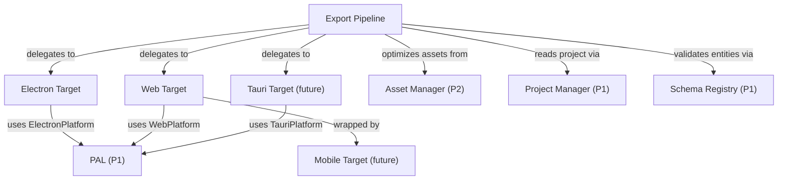

# Phase 6: Export

> **Status**: Draft
> **Last updated**: 2026-04-16
> **Parent**: [00-overview.md](./00-overview.md)
> **Prerequisite**: Phases 1–5 complete

---

## Module 21: Export Pipeline

### 21.1 Problem

Users need to distribute their finished games. The export pipeline takes a project and produces a standalone application for the target platform. Export is a **plugin system** — each runtime target is a plugin that knows how to bundle and package the game for its platform. The pipeline must also optimize assets for distribution: compress textures, transcode audio, strip unused files, and optionally encrypt assets.

### 21.2 Requirements

| ID | Requirement | Priority |
|---|---|---|
| EP-01 | Export pipeline architecture: pluggable export targets | Must |
| EP-02 | First export target: Electron desktop app (Windows, macOS, Linux) | Must |
| EP-03 | Export dialog in the editor: select target, configure options, build | Must |
| EP-04 | Tree-shake editor-only code (editor UI, json-render catalog, debug tools) | Must |
| EP-05 | Bundle project data (entities, maps, assets) into the output | Must |
| EP-06 | Progress reporting during export (asset copying, bundling, packaging) | Must |
| EP-07 | Code signing support for macOS and Windows | Should |
| EP-08 | Export presets (save target + options for quick re-export) | Should |
| EP-09 | Exclude unused files: only bundle assets actually referenced by entities/maps | Must |
| EP-10 | Asset encryption: optionally encrypt image and audio assets to protect IP | Should |
| EP-11 | Asset optimization pass (texture atlasing, audio transcoding) | Should |
| EP-12 | Auto-update support for distributed Electron games | Could |

### 21.3 Export Target Plugin Interface

```typescript
interface ExportTarget {
  /** Unique target ID. */
  id: string;
  /** Display name in the export dialog. */
  name: string;
  /** Platforms this target produces builds for. */
  platforms: ("windows" | "macos" | "linux" | "web")[];
  /** Target-specific configuration schema. */
  configSchema: z.ZodObject<any>;

  /**
   * Execute the export.
   * Receives the project data and target-specific config.
   * Reports progress via callback.
   * Returns the output path(s).
   */
  export(context: ExportContext): Promise<ExportResult>;
}

interface ExportContext {
  /** Full project data. */
  project: Project;
  /** Target-specific config (validated against configSchema). */
  config: unknown;
  /** Output directory. */
  outputDir: string;
  /** Progress callback (0-1). */
  onProgress: (progress: number, stage: string) => void;
  /** PAL for file operations. */
  platform: Platform;
  /** Asset optimization options. */
  optimization: AssetOptimizationConfig;
}

interface ExportResult {
  /** Paths to the generated output files/directories. */
  outputs: string[];
  /** Warnings generated during export. */
  warnings: string[];
  /** Export statistics. */
  stats: ExportStats;
}

interface ExportStats {
  totalAssets: number;
  includedAssets: number;
  excludedUnusedAssets: number;
  originalSize: number;       // bytes
  optimizedSize: number;      // bytes
  buildDuration: number;      // ms
}
```

### 21.4 Export Flow

```
User opens Export dialog
        │
        ▼
  Select target: [Electron Desktop ▾]
  Select platforms: [✓ Windows] [✓ Linux] [☐ macOS]
  Configure: App name, version, icon, window size
  Options: [✓ Exclude unused files] [☐ Encrypt assets] [✓ Optimize assets]
        │
        ▼
  [Export] button clicked
        │
        ▼
  Phase 1: Validate
  ├── All entities pass Schema Registry validation
  ├── All asset references resolve to existing files
  └── Report validation warnings (e.g. unreferenced events)
        │
        ▼
  Phase 2: Collect & Optimize Assets
  ├── Walk all entities, maps, events — build asset reference graph
  ├── Exclude files not in the reference graph (if enabled)
  ├── Texture optimization:
  │   ├── Combine loose sprites into texture atlases (≤2048×2048)
  │   ├── Convert PNG → WebP (lossy/lossless based on config)
  │   └── Validate atlas sizes for target platform compatibility
  ├── Audio optimization:
  │   ├── Transcode BGM to Opus (high quality, small size)
  │   ├── Transcode SE to Opus (low latency)
  │   └── Preserve original format as fallback option
  └── Encrypt assets (if enabled): AES-256 with project-specific key
        │
        ▼
  Phase 3: Bundle Code
  ├── Vite/esbuild builds the engine from the runtime entry point
  ├── Tree-shake: editor UI, json-render, debug tools, Command history UI
  ├── Minify JavaScript output
  └── Generate source maps (optional, for crash reporting)
        │
        ▼
  Phase 4: Bundle Project Data
  ├── Serialize all entities to optimized JSON (no meta.createdAt/modifiedAt)
  ├── Combine entity files into per-type bundles (actors.dat, items.dat, etc.)
  └── Generate asset manifest with optimized paths
        │
        ▼
  Phase 5: Platform Packaging
  └── Delegate to the ExportTarget plugin:
      ├── Electron: electron-builder → .exe/.AppImage/.dmg
      ├── Web: static site generation
      └── Custom: plugin-defined packaging
        │
        ▼
  Phase 6: Finalize
  ├── Code sign (macOS/Windows, if configured)
  ├── Generate blockmap for differential updates (Electron)
  ├── Display export statistics
  └── Open output directory
        │
        ▼
  Output: /exports/my-game-win32-x64/
          /exports/my-game-linux-x64.AppImage
          Build stats: 847 assets included, 23 unused excluded
                       Original: 156 MB → Optimized: 89 MB (43% reduction)
```

### 21.5 Unused File Exclusion

RPG Maker MZ's "Exclude Unused Files" feature is one of its most requested deployment options. Eternity implements this by building an asset reference graph:

```
1. Walk all entity files (actors, items, maps, events, tilesets, etc.)
2. Extract every string field that matches an asset path pattern
   (e.g. "assets/characters/hero-walk.png", "assets/audio/bgm/battle.ogg")
3. Walk all event commands for asset references
   (Play BGM, Show Animation, Change Character Graphic, etc.)
4. Walk all tileset definitions for texture references
5. Union of all referenced paths = the "used" set
6. Anything in assets/ not in the "used" set = excludable

Warning: Scripts (text scripting sandbox) may reference assets dynamically.
The pipeline emits warnings for unanalyzable script asset references.
```

### 21.6 Asset Encryption

Optional asset protection for commercial games:

| Aspect | Implementation |
|---|---|
| **Algorithm** | AES-256-CBC |
| **Key storage** | Key embedded in the compiled engine binary (obfuscated, not truly secure) |
| **Scope** | Image files (`.png`, `.webp`) and audio files (`.ogg`, `.opus`) |
| **Not encrypted** | JSON data files, JavaScript, HTML — these need to be parseable at runtime |
| **Decryption** | Runtime decryption in the Asset Manager before passing to PixiJS/Web Audio |
| **Caveat** | Same limitation as RPG Maker: determined users can extract assets from memory. This is a deterrent, not DRM. |

### 21.7 Electron Export Target (Detailed)

The first-party export target, dog-fooding the same Electron shell the editor uses:

| Config Option | Type | Default | Description |
|---|---|---|---|
| `appName` | string | Project name | Application display name |
| `appVersion` | string | Project version | Semver version string |
| `icon` | string | Default icon | Path to 1024×1024 PNG icon |
| `windowWidth` | number | 816 | Initial window width |
| `windowHeight` | number | 624 | Initial window height |
| `fullscreen` | boolean | false | Launch in fullscreen |
| `resizable` | boolean | true | Allow window resizing |
| `platforms` | string[] | Current OS | Target platforms to build for |
| `enableAutoUpdate` | boolean | false | Include electron-updater for auto-updates |
| `updateServerUrl` | string | — | URL for update server (GitHub Releases, S3, etc.) |
| `encryptAssets` | boolean | false | Encrypt image/audio assets |

#### Packaging via `electron-builder`

| Platform | Output Format | Notes |
|---|---|---|
| **Windows** | NSIS installer (`.exe`) | Blockmap generated for differential updates |
| **Linux** | AppImage (`.AppImage`) + `.deb` | AppImage is self-contained, no install required |
| **macOS** | DMG (`.dmg`) | Requires code signing for Gatekeeper |

#### ASAR Configuration

```yaml
# electron-builder config
asar: true
asarUnpack:
  - "**/*.node"           # Native modules must be unpacked
  - "assets/movies/**"    # Large video files load faster unpacked
```

- ASAR integrity enabled for tamper detection
- Large assets (videos, BGM) unpacked from ASAR to avoid virtual extraction overhead
- Native modules always unpacked

#### Auto-Update Strategy

For games distributed via itch.io, Steam, or direct download:

```typescript
// Runtime auto-update integration (when enableAutoUpdate = true)
import { autoUpdater } from "electron-updater";

autoUpdater.setFeedURL({ url: config.updateServerUrl });
autoUpdater.checkForUpdatesAndNotify();

// Differential updates via blockmap:
// - electron-builder generates .blockmap alongside each release
// - On update check, only changed blocks are downloaded
// - Caveat: if ASAR layout shifts significantly, diff savings are minimal
// - Recommendation: keep asset packing deterministic to maximize diff efficiency
```

### 21.8 Tree-Shaking Strategy

The exported game must not include editor code:

| Included | Excluded |
|---|---|
| Game engine (renderer, ECS, scene manager, etc.) | Editor UI (React panels, json-render catalog) |
| PixiJS runtime | Map Editor, Database Editor, Playtest debug tools |
| Event system, battle engine, audio | Schema Registry editor features (form generation) |
| `ElectronPlatform` (runtime subset) | Command pattern undo/redo UI |
| Project data (entities, maps, assets) | `.eternity/` directory |
| Runtime plugin code (`runtime` target) | Editor plugin code (`editor` target) |

**Implementation**: The codebase is structured as a monorepo with separate packages:

```
packages/
├── engine/           # Game engine (included in all exports)
├── editor/           # Editor UI (never exported)
├── platform-electron/ # ElectronPlatform (included in Electron exports)
├── platform-web/     # WebPlatform (included in web exports)
├── platform-headless/ # HeadlessPlatform (included in server exports)
└── shared/           # Types, schemas, utilities (included everywhere)
```

Each export target builds from `packages/engine` + the appropriate platform package. The `packages/editor` package is never part of any export entry point.

### 21.9 Asset Optimization Pipeline

| Asset Type | Optimization | Config |
|---|---|---|
| **Textures (PNG)** | Convert to WebP (lossless or lossy), optional atlas packing | Quality: 0–100, atlas max size: 1024/2048/4096 |
| **Sprite sheets** | Already atlased — convert format only | Format: PNG (no change) or WebP |
| **BGM (OGG/MP3)** | Transcode to Opus at configurable bitrate | Bitrate: 96–192 kbps |
| **SE (OGG/MP3/WAV)** | Transcode to Opus, optimize for low latency | Bitrate: 64–128 kbps |
| **JSON data** | Strip editor metadata (`meta.createdAt`, etc.), minify | Always enabled |
| **Videos** | Pass through (already compressed) | No optimization |

Optimization is optional and configurable per-export. Users building for itch.io game jams may skip optimization for faster builds. Users shipping commercial games will want full optimization.

---

## Module 22: Additional Runtime Targets

### 22.1 Requirements

| ID | Requirement | Priority |
|---|---|---|
| RT-01 | Web export target (static site, deployable to itch.io/any host) | Should |
| RT-02 | Tauri export target (lightweight alternative to Electron) | Could |
| RT-03 | Mobile export target (web export wrapped via Capacitor) | Could |
| RT-04 | Each target implements the `ExportTarget` interface | Must |
| RT-05 | Community can create custom export targets as plugins | Should |

### 22.2 Web Export Target

```typescript
const webExportTarget: ExportTarget = {
  id: "web",
  name: "Web (Static Site)",
  platforms: ["web"],
  configSchema: z.object({
    title: z.string(),
    favicon: z.string().optional(),
    embedAssets: z.boolean().default(false),
    pwa: z.boolean().default(false),
    serviceWorker: z.boolean().default(false),
  }),

  async export(context) {
    // 1. Bundle engine with WebPlatform (no Node.js APIs)
    // 2. Generate index.html with PixiJS canvas
    // 3. Copy/embed assets
    // 4. Generate PWA manifest + service worker (if enabled)
    // 5. Output: static directory deployable to any web server
  },
};
```

#### Web Platform Differences

| Capability | Electron | Web |
|---|---|---|
| **Filesystem** | Full Node.js `fs` via IPC | None — assets loaded via HTTP fetch |
| **Save/Load** | Files on disk | IndexedDB via `idb` wrapper library |
| **Native Dialogs** | Electron `dialog` API | Browser file picker / download |
| **Audio** | Web Audio API (same) | Web Audio API (same) |
| **Gamepad** | Web Gamepad API (same) | Web Gamepad API (same) |
| **Fullscreen** | Electron window API | Fullscreen API (`requestFullscreen()`) |
| **Window title** | `BrowserWindow.setTitle()` | `document.title` |

#### PWA / Offline Support

When `pwa: true` is enabled:

1. **Web App Manifest** — generated `manifest.json` with app name, icons, theme color, `display: "fullscreen"`
2. **Service Worker** — generated via Workbox:
   - **Precache**: `index.html`, JS bundles, CSS, core system assets
   - **Runtime cache**: game assets (textures, audio) using `CacheFirst` strategy — loaded once from network, then served from cache
3. **Save Data** — `WebPlatform.storage` uses IndexedDB via `idb` library for save files, preferences, and game state

This enables "install to home screen" on mobile browsers and full offline play after initial asset download.

#### itch.io Deployment

The web export output is directly uploadable to itch.io as an HTML5 game:

```
my-game-web/
├── index.html          # Entry point (itch.io auto-detects)
├── game.js             # Bundled engine + project
├── game.css
├── assets/             # Optimized game assets
│   ├── tilesets/
│   ├── characters/
│   └── audio/
├── manifest.json       # PWA manifest (if enabled)
└── sw.js              # Service worker (if enabled)
```

### 22.3 Tauri Export Target (Future)

Tauri v2 offers significant advantages for game distribution:

| Aspect | Electron | Tauri v2 |
|---|---|---|
| **Bundle size** | 100–200+ MB | 3–10 MB |
| **Memory usage** | 150–400 MB | 30–80 MB |
| **Startup time** | 2–5 seconds | <1 second |
| **Backend** | Node.js | Rust |
| **Mobile support** | No | Android + iOS |

**Why not Tauri first?**

1. The *editor* requires Electron (deep Node.js integration, IPC, filesystem, native dialogs). Tauri's Rust backend is a different paradigm.
2. The PAL architecture means Tauri support is a matter of implementing `TauriPlatform` — the engine doesn't need to change.
3. Electron export dog-foods the same shell as the editor — maximum confidence in compatibility.

**When to add Tauri:**
- After Electron export is stable
- Implement `TauriPlatform` as a PAL implementation (filesystem via Tauri's Rust bridge, audio via Web Audio, etc.)
- Major win for mobile export: Tauri v2 supports Android/iOS natively, avoiding the Cordova/Capacitor wrapping approach

### 22.4 Mobile Export Strategy

For v1, mobile is achieved by wrapping the web export:

```
Web Export Output
       │
       ▼
  Capacitor / Cordova wrapping:
  ├── Generate native Android project (Android Studio)
  ├── Generate native iOS project (Xcode)
  ├── Configure touch input mapping
  └── Package as APK/IPA
```

This follows RPG Maker MZ's exact approach (web export → Cordova → APK). Eternity doesn't try to be clever here — the web engine already works in mobile browsers. The wrapper adds native app packaging, home screen installation, and performance optimizations.

**Post-v1**: Tauri v2's native mobile support would replace the Cordova/Capacitor approach with a lighter, faster solution.

### 22.5 Design Decisions

| Decision | Rationale |
|---|---|
| **Export as plugin system** | New platforms (mobile, console, Tauri) can be added without changing the core export pipeline. Third-party targets are first-class. |
| **Electron first** | Dog-foods the same shell the editor uses. Most reliable path to a working export. |
| **Web second** | The engine already runs in a browser context (PixiJS + Web Audio). Web export is mostly about bundling and the `WebPlatform` PAL implementation. Doubles as the foundation for mobile and itch.io distribution. |
| **Tauri third (future)** | The PAL makes this a clean addition. Massive bundle size and memory wins, plus native mobile. But the editor stays on Electron — Tauri is an *export* target, not an editor replacement. |
| **Config schemas via Zod** | Export target config uses the same Zod schemas as everything else. The export dialog auto-generates its form from the target's `configSchema`, just like the Database Editor generates forms from entity schemas. |
| **Asset encryption as deterrent, not DRM** | Same caveat as RPG Maker: in-memory assets can always be extracted. Encryption raises the effort bar for casual ripping, which is sufficient for the target audience. |
| **Opus for audio transcoding** | Best quality-per-byte ratio of any web-compatible audio codec. Supported by all modern browsers and Electron. |
| **WebP for texture optimization** | 25–35% smaller than PNG at equivalent quality. PixiJS v8 loads WebP natively. Lossless mode preserves pixel-perfect art. |

---

## Cross-Module Dependencies



---

## Acceptance Criteria

Phase 6 is complete when:

- [ ] Electron export produces a runnable `.AppImage` on Linux and `.exe` on Windows
- [ ] Exported game launches, loads a map, and gameplay works (movement, events, battles)
- [ ] Exported game does not include editor UI code (verified by bundle size / inspection)
- [ ] "Exclude unused files" correctly identifies and strips unreferenced assets
- [ ] Export statistics report original vs. optimized size and asset counts
- [ ] Export dialog shows progress with stage descriptions and reports warnings
- [ ] Export presets save and restore target configuration
- [ ] Asset encryption round-trips correctly (encrypt on export, decrypt at runtime)
- [ ] Web export produces a static directory that runs the game in a browser
- [ ] Web export uploaded to itch.io plays correctly in an iframe
- [ ] PWA mode: service worker caches assets, game works offline after initial load
- [ ] Web save/load uses IndexedDB correctly (create save, close browser, reopen, load save)
- [ ] A custom export target plugin can be registered and appears in the export dialog
- [ ] Texture optimization (PNG → WebP) reduces asset directory size by ≥20%
- [ ] Audio optimization (MP3/WAV → Opus) reduces audio size by ≥30%
