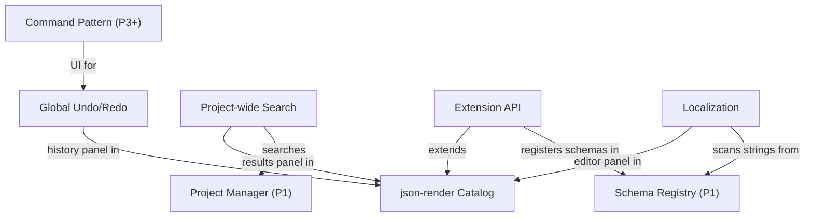

# Phase 7: Polish

> **Status**: Draft
> **Last updated**: 2026-04-16
> **Parent**: [00-overview.md](./00-overview.md)
> **Prerequisite**: Phases 1–6 complete

These modules are listed last but their **boundaries are designed from Phase 1 onward**:
- Command pattern is enforced since Phase 3 — this phase adds the UI
- Extension API boundaries inform every module's design — this phase formalizes the public surface
- Localization scanning depends on Schema Registry string detection — designed since Phase 1

---

## Module 23: Global Undo/Redo

### 23.1 Problem

The Command pattern has been in place since Phase 3, but there's no unified UI for navigating the command history. Global Undo/Redo gives users Ctrl+Z / Ctrl+Shift+Z across all editor operations.

### 23.2 Requirements

| ID | Requirement | Priority |
|---|---|---|
| UR-01 | Ctrl+Z undoes the last command across all editors (map, database, events) | Must |
| UR-02 | Ctrl+Shift+Z (or Ctrl+Y) redoes the last undone command | Must |
| UR-03 | Command history panel showing the stack of executed commands | Must |
| UR-04 | Click a history entry to jump to that point (batch undo/redo) | Should |
| UR-05 | Command descriptions are human-readable ("Paint 12 tiles on Layer 1") | Must |
| UR-06 | History is per-project, cleared on project close | Must |
| UR-07 | Configurable history depth (default: 100 commands) | Should |
| UR-08 | Compound commands: group related edits into one undoable unit | Must |

### 23.3 Interface Design

```typescript
interface CommandHistory {
  /** Execute a command and push it onto the history. */
  execute<T>(command: Command<T>): T;

  /** Execute multiple commands as a single undoable unit. */
  executeCompound(label: string, commands: Command[]): void;

  /** Undo the last command. Returns false if nothing to undo. */
  undo(): boolean;

  /** Redo the last undone command. Returns false if nothing to redo. */
  redo(): boolean;

  /** Whether undo is available. */
  canUndo(): boolean;

  /** Whether redo is available. */
  canRedo(): boolean;

  /** Full history for the history panel UI. */
  entries(): readonly HistoryEntry[];

  /** Jump to a specific point in history. */
  jumpTo(index: number): void;

  /** Clear all history. */
  clear(): void;

  /** Subscribe to history changes (for UI reactivity). */
  onChange(callback: () => void): Disposable;
}

interface HistoryEntry {
  index: number;
  description: string;
  timestamp: number;
  isCurrent: boolean;  // Marks the current position in the stack
}
```

### 23.4 Compound Command Examples

| User Action | Individual Commands | Compound Label |
|---|---|---|
| Flood fill on map | N × `PaintTileCommand` | "Flood fill Layer 1 (47 tiles)" |
| Delete actor from database | `DeleteEntityCommand` + N × `UpdateReferenceCommand` | "Delete actor 'hero' (updated 3 references)" |
| Paste map region | N × `PaintTileCommand` + M × `CreateEventCommand` | "Paste region (15×10 tiles, 3 events)" |

---

## Module 24: Project-wide Search

### 24.1 Problem

As projects grow, finding specific content — an NPC's dialogue, which event uses a particular variable, where an item is referenced — becomes tedious without search.

### 24.2 Requirements

| ID | Requirement | Priority |
|---|---|---|
| PS-01 | Full-text search across all entity data (names, text fields, script content) | Must |
| PS-02 | Search results show entity type, name, field path, and matching text | Must |
| PS-03 | Click a result to navigate to that entity in the appropriate editor | Must |
| PS-04 | Filter by entity type (search only in actors, only in events, etc.) | Should |
| PS-05 | Reference search: "find all entities that reference item X" | Should |
| PS-06 | Variable/switch usage search: "find all events that use Switch 5" | Should |
| PS-07 | Search keyboard shortcut: Ctrl+Shift+F | Must |
| PS-08 | Regex search support | Could |

### 24.3 Implementation Strategy

```typescript
interface ProjectSearch {
  /**
   * Search across all loaded entities.
   * Returns matches grouped by entity.
   */
  search(query: string, options?: SearchOptions): SearchResult[];
  
  /**
   * Find all entities that reference a specific entity ID.
   */
  findReferences(type: string, id: string): SearchResult[];

  /**
   * Find all events using a specific variable or switch.
   */
  findUsages(type: "variable" | "switch", id: number): SearchResult[];
}

interface SearchResult {
  entityType: string;
  entityId: string;
  entityName: string;
  matches: SearchMatch[];
}

interface SearchMatch {
  fieldPath: string;       // e.g. "data.commands[3].params.text"
  matchedText: string;
  context: string;         // Surrounding text for preview
}

interface SearchOptions {
  entityTypes?: string[];    // Filter to specific types
  caseSensitive?: boolean;
  regex?: boolean;
}
```

Search operates on the in-memory `EntityStore` — no separate index needed for typical project sizes. For very large projects, a background indexing step could be added later.

---

## Module 25: Extension API

### 25.1 Problem

Every module has been designed with extension boundaries in mind. This phase formalizes the public API surface, plugin lifecycle, and documentation.

### 25.2 Requirements

| ID | Requirement | Priority |
|---|---|---|
| EX-01 | Plugin manifest format (`eternity-plugin.json`) | Must |
| EX-02 | Plugin lifecycle: discover → validate → load → init → teardown | Must |
| EX-03 | Editor plugins: extend json-render catalog with new components | Must |
| EX-04 | Runtime plugins: register custom ECS components and systems | Must |
| EX-05 | Schema plugins: register custom entity types in the Schema Registry | Must |
| EX-06 | Event command plugins: add custom commands to the event editor | Must |
| EX-07 | Export target plugins: add custom export targets | Must |
| EX-08 | Plugin sandboxing: plugins cannot access other plugins' internals | Should |
| EX-09 | Plugin API versioning: plugins declare compatible Eternity versions | Must |
| EX-10 | Plugin developer documentation and starter template | Should |

### 25.3 Plugin Manifest

```json
{
  "name": "crafting-system",
  "version": "1.0.0",
  "displayName": "Crafting System",
  "description": "Adds a crafting station, recipes, and materials.",
  "author": "Community Dev",
  "eternity": "^1.0.0",
  "targets": ["editor", "runtime"],

  "editor": {
    "catalogEntries": "editor/catalog.ts",
    "styles": "editor/styles.css"
  },

  "runtime": {
    "entryPoint": "runtime/index.ts",
    "components": ["CraftingStation", "Recipe"],
    "systems": ["CraftingSystem"]
  },

  "schemas": [
    { "key": "plugin:crafting-system:recipe", "file": "schemas/recipe.ts" }
  ],

  "eventCommands": [
    { "code": "crafting:open-station", "file": "commands/open-station.ts" }
  ]
}
```

### 25.4 Plugin Extension Points

| Extension Point | What plugins can do | API |
|---|---|---|
| **json-render Catalog** | Add editor panels, inspectors, tool windows | `catalog.register({ components: {...} })` |
| **Schema Registry** | Define new entity types | `registry.register("plugin:...", zodSchema)` |
| **Entity System** | Add components and systems | `ecs.registerComponent(...)`, `ecs.registerSystem(...)` |
| **Event Commands** | Add commands to the event editor | `events.registerCommand("code", handler)` |
| **Export Targets** | Add export platforms | `exports.registerTarget(target)` |
| **Debug Panels** | Add playtest debug panels | `debug.registerPanel(panel)` |
| **Scene Types** | Add custom game scenes | `scenes.registerType("id", sceneFactory)` |

### 25.5 Plugin Lifecycle

```
Editor starts
        │
        ▼
  Scan plugins/ directory for eternity-plugin.json manifests
        │
        ▼
  For each manifest:
  ├── Validate manifest schema
  ├── Check eternity version compatibility
  └── Sort by dependency order (if declared)
        │
        ▼
  Load phase (sequential):
  ├── Import plugin modules
  ├── Register schemas
  ├── Register catalog entries
  ├── Register event commands
  └── Register ECS components/systems
        │
        ▼
  Init phase:
  └── Call plugin.init() (plugin-specific setup)
        │
        ▼
  Editor runs... plugins are active...
        │
        ▼
  Teardown (on editor close or plugin disable):
  ├── Call plugin.teardown()
  ├── Unregister schemas
  ├── Unregister catalog entries
  └── Unregister ECS components/systems
```

### 25.6 Design Decisions

| Decision | Rationale |
|---|---|
| **Separate editor/runtime targets** | Editor plugins (UI panels) should never be bundled into exported games. Runtime plugins (game logic) should never depend on React or json-render. The manifest makes this split explicit. |
| **Registration-based, not monkey-patching** | Plugins call `register()` methods on well-defined extension points. They can't reach into engine internals or override private methods. |
| **Version compatibility via semver** | `"eternity": "^1.0.0"` ensures plugins aren't loaded against incompatible engine versions. Prevents cryptic runtime errors. |
| **Manual distribution for v1** | No plugin registry or marketplace in v1. Plugins are zip files placed in `plugins/`. This can be expanded later without changing the plugin format. |

---

## Module 26: Localization Tooling

### 26.1 Problem

RPG games contain enormous amounts of text: dialogue, item names, skill descriptions, UI labels. Translating this content requires extracting all translatable strings, providing an editing interface, and applying the correct language at runtime.

### 26.2 Requirements

| ID | Requirement | Priority |
|---|---|---|
| LO-01 | Auto-extract translatable strings from all entity data (scanning `z.string()` fields in schemas) | Must |
| LO-02 | Locale files stored as JSON in `data/locales/{lang}/` | Must |
| LO-03 | String key generation from entity type + ID + field path | Must |
| LO-04 | Localization editor panel: side-by-side base language and target language | Must |
| LO-05 | Translation progress tracking (% complete per locale) | Must |
| LO-06 | Runtime locale switching (change language without restarting the game) | Must |
| LO-07 | Fallback to base language for untranslated strings | Must |
| LO-08 | String interpolation: `"Hello, {playerName}!"` | Should |
| LO-09 | Plural forms and gender-aware text | Could |
| LO-10 | Export/import translation files (for external translators) | Should |

### 26.3 Localization Architecture

```
Schema Registry                  Entity Data
      │                               │
      ▼                               ▼
 Scan z.string() fields ──► Extract string values
                                      │
                                      ▼
                           Generate locale keys:
                           "actor.hero.data.name" = "Hero"
                           "event.old-man.commands[0].text" = "Welcome!"
                                      │
                                      ▼
                           Base locale file:
                           data/locales/en/strings.json
                                      │
                                      ▼
                           Translator edits:
                           data/locales/ja/strings.json
                           { "actor.hero.data.name": "勇者" }
                                      │
                                      ▼
                           Runtime: lookup key → current locale → fallback to base
```

### 26.4 Locale File Format

```json
// data/locales/en/strings.json (base — auto-generated, editable)
{
  "actor.hero.data.name": "Hero",
  "actor.merchant-nora.data.name": "Nora",
  "item.potion.data.name": "Potion",
  "item.potion.data.description": "Restores 50 HP.",
  "event.old-man-npc.pages[0].commands[0].params.text": "Welcome, traveler.",
  "event.old-man-npc.pages[0].commands[1].params.choices": ["Yes", "No"]
}
```

### 26.5 Localization Editor

```
┌──────────────────────────────────────────────────────────┐
│  Localization: English → Japanese    [Progress: 67%]     │
├──────────┬────────────────────┬───────────────────────────┤
│ Filter   │ Key                │ English     │ Japanese    │
│          │                    │             │             │
│ [All   ▾]│ actor.hero.name   │ Hero        │ 勇者        │
│          │ actor.nora.name   │ Nora        │ ノラ        │
│ [Actors] │ item.potion.name  │ Potion      │ ポーション    │
│ [Items ] │ item.potion.desc  │ Restores 50 │ [untranslated]│
│ [Events] │ event.old-man...  │ Welcome,... │ ようこそ...   │
│          │                    │             │             │
│ [Missing]│                    │             │             │
└──────────┴────────────────────┴─────────────┴─────────────┘
```

### 26.6 Design Decisions

| Decision | Rationale |
|---|---|
| **Auto-extraction from schemas** | The Schema Registry knows which fields are `z.string()`. Scanning schemas for string fields automatically finds translatable content — no manual tagging needed. |
| **Key = entity path** | `"actor.hero.data.name"` is deterministic, readable, and survives entity edits (the key only changes if the entity is renamed). |
| **JSON locale files** | Same format as everything else. Git-friendly, diffable. Translators can work in external tools and submit PRs. |
| **Locale files are per-entity-type, not monolithic** | Could be split into `actors.json`, `items.json`, etc. for easier parallel translation work. TBD based on project scale. |

---

## Cross-Module Dependencies



**Build order within Phase 7:**
1. **Global Undo/Redo** — UI for the command history that's been accumulating since Phase 3
2. **Project-wide Search** — independent utility, no dependencies beyond the EntityStore
3. **Extension API** — formalizes all the registration patterns used by prior modules
4. **Localization Tooling** — depends on Schema Registry scanning and the finalized Extension API

---

## Acceptance Criteria

Phase 7 is complete when:

- [ ] Ctrl+Z undoes the last operation across map editor, database editor, and event editor
- [ ] Ctrl+Shift+Z redoes correctly
- [ ] Command history panel shows all operations with human-readable descriptions
- [ ] Compound commands (flood fill) undo as a single unit
- [ ] Ctrl+Shift+F opens project search, finds text across entities, clicking navigates to the result
- [ ] Reference search finds all entities referencing a specific item/actor
- [ ] A sample plugin loads from `plugins/`, registers a custom schema, catalog component, and event command
- [ ] Plugin appears in the Database Editor sidebar, editor panels render, event command is usable
- [ ] Plugin teardown removes all registrations cleanly
- [ ] Localization extraction scans all entities and generates a base locale file
- [ ] Localization editor shows side-by-side editing with progress tracking
- [ ] Runtime locale switching changes all visible strings without game restart
- [ ] Untranslated strings fall back to the base language
